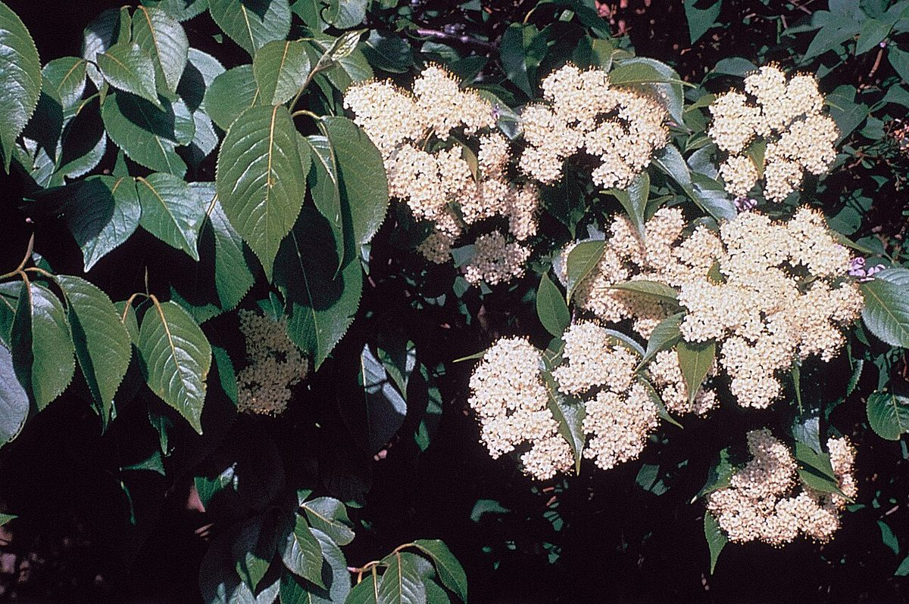

# Nannyberry

*Viburnum lentago*

Viburnum lentago, the nannyberry, sheepberry, or sweet viburnum, is a species of Viburnum native to North America.

## Quick Facts

| | |
|---|---|
| **Scientific name** | *Viburnum lentago* |
| **Family** | — |
| **Height** | — |
| **Bloom time** | — |
| **Sun** | — |
| **Moisture** | — |
| **Soil** | — |
| **Wildlife value** | — |

## Mentioned In

- [Woodland Forest Plants](../chapters/04-woodland-forest-plants/index.md)

## Image Credits

- Herman, D.E., et al. 1996. North Dakota tree handbook. USDA NRCS ND State Soil Conservation Committee; NDSU Extension and Western Area Power Administration, Bismarck. Courtesy of ND State Soil Conserv (Public domain)
- Unknown (Public domain)

## Learn More

- [Wikipedia: Viburnum lentago](https://en.wikipedia.org/wiki/Viburnum_lentago)
