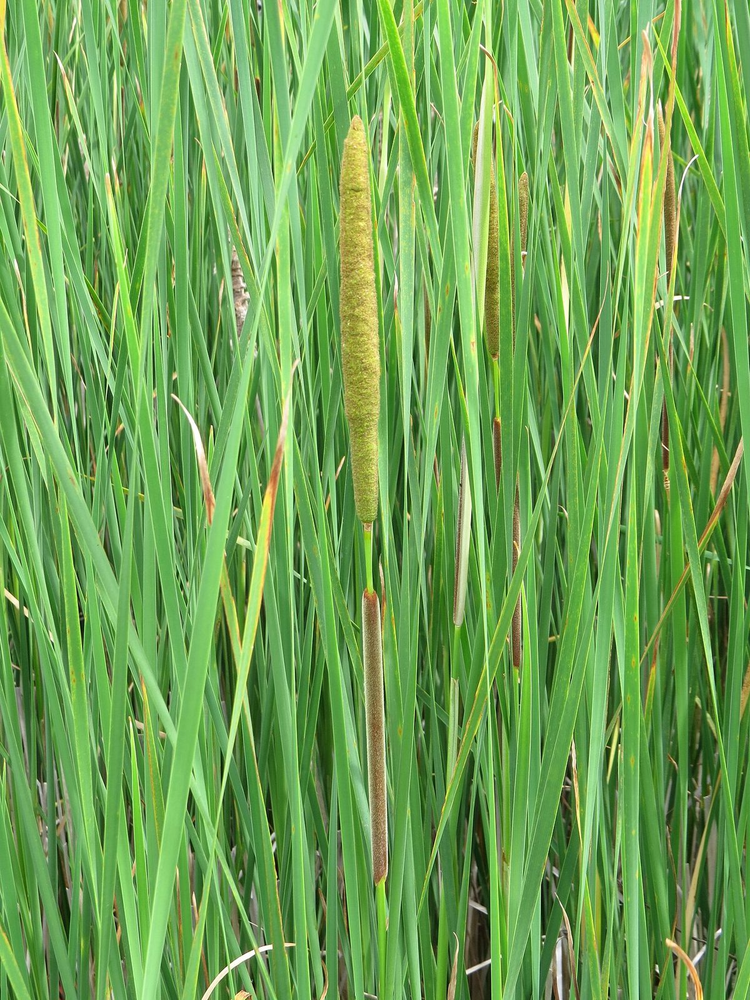
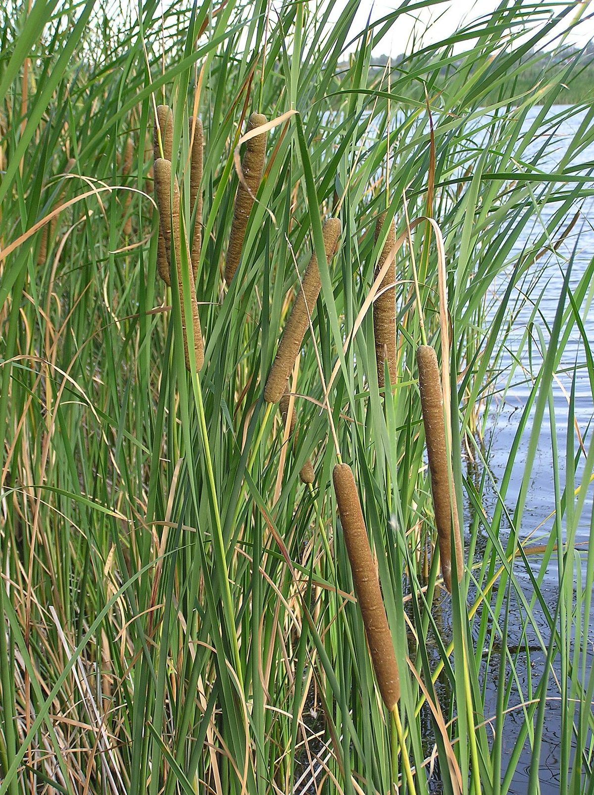

# Narrow-Leaved Cattail

*Typha angustifolia*

Typha angustifolia is a perennial herbaceous plant in the genus Typha, native throughout most of Eurasia and locally in northwest Africa; it also occurs widely in North America, where its native status is disputed. It is an "obligate wetland" species that is found in fresh water or brackish locations. It is known in British English as lesser bulrush, and in North American English as narrowleaf cattail.

## Quick Facts

| | |
|---|---|
| **Scientific name** | *Typha angustifolia* |
| **Family** | — |
| **Height** | — |
| **Bloom time** | — |
| **Sun** | — |
| **Moisture** | — |
| **Soil** | — |
| **Wildlife value** | — |

## Mentioned In

- [Plant Identification Skills](../chapters/07-plant-identification-skills/index.md)

## Image Credits

- MPF (CC BY-SA 4.0)
- Le.Loup.Gris (CC BY-SA 3.0)

## Learn More

- [Wikipedia: Typha angustifolia](https://en.wikipedia.org/wiki/Typha_angustifolia)
