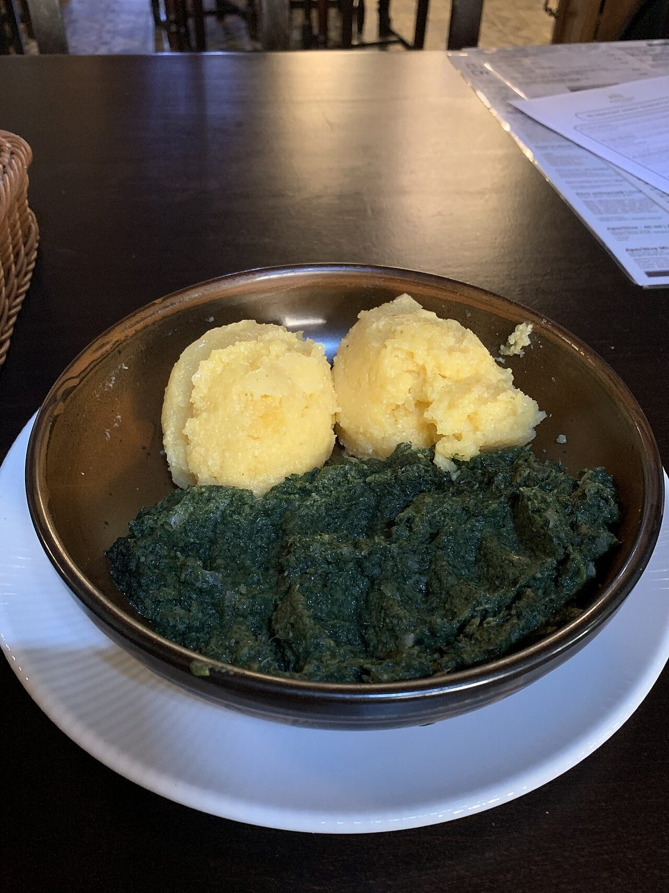

# Nettle

*Urtica dioica*

Urtica dioica, often known as common nettle, burn nettle, stinging nettle, nettle leaf, or just a nettle or stinger, is a herbaceous perennial flowering plant in the family Urticaceae. Originally native to Europe, much of temperate Asia and western North Africa, it is now found worldwide. 
The species is divided into six subspecies, five of which have many hollow stinging hairs called trichomes on the leaves and stems, which act like hypodermic needles, injecting histamine and other chemicals that produce a stinging sensation upon contact ("contact urticaria", a form of contact dermatitis).

## Quick Facts

| | |
|---|---|
| **Scientific name** | *Urtica dioica* |
| **Family** | — |
| **Height** | — |
| **Bloom time** | — |
| **Sun** | — |
| **Moisture** | — |
| **Soil** | — |
| **Wildlife value** | — |

## Mentioned In

- [Cultural Indigenous Uses](../chapters/13-cultural-indigenous-uses/index.md)

## Image Credits

- Kobako (CC BY-SA 2.5)
- Chainwit. (CC BY-SA 4.0)

## Learn More

- [Wikipedia: Urtica dioica](https://en.wikipedia.org/wiki/Urtica_dioica)
