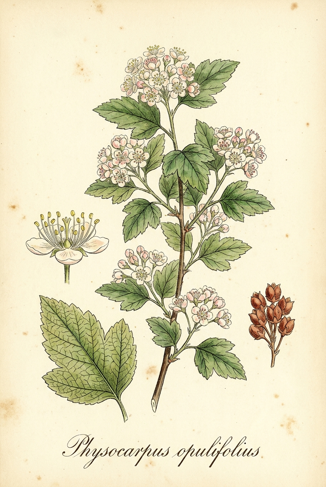
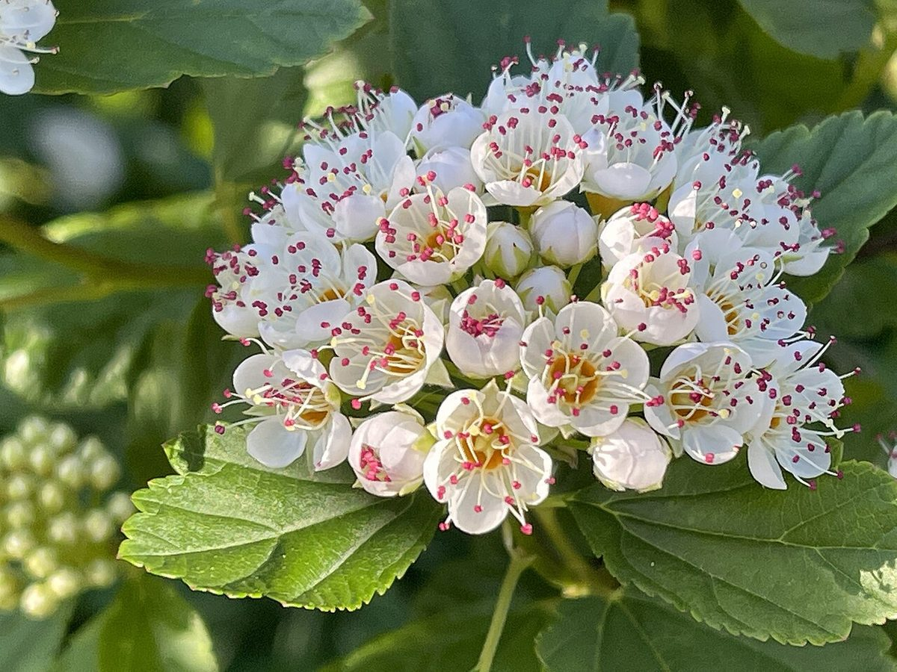

# Ninebark

*Physocarpus opulifolius*

{ .plant-illustration }

*Botanical plate of* **Physocarpus opulifolius** *— Curtis-style illustration.*

Physocarpus opulifolius,  known as common ninebark, Eastern ninebark, Atlantic ninebark, or simply ninebark, is a species of flowering plant in the rose family Rosaceae, native to eastern North America, named for its peeling multi-hued bark.

## Quick Facts

| | |
|---|---|
| **Scientific name** | *Physocarpus opulifolius* |
| **Family** | — |
| **Height** | — |
| **Bloom time** | — |
| **Sun** | — |
| **Moisture** | — |
| **Soil** | — |
| **Wildlife value** | — |

## Mentioned In

- [Garden Design Native Plants](../chapters/10-garden-design-native-plants/index.md)

## Image Credits

- Anatoly Mikhaltsov (CC BY-SA 4.0)
- Nichole Ouellette (CC BY-SA 4.0)

## Learn More

- [Wikipedia: Physocarpus opulifolius](https://en.wikipedia.org/wiki/Physocarpus_opulifolius)
