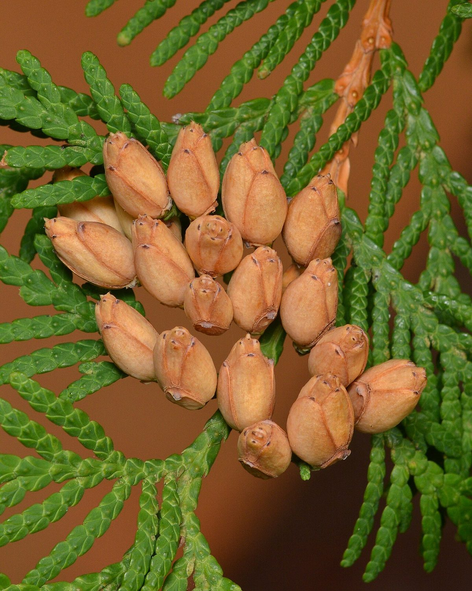
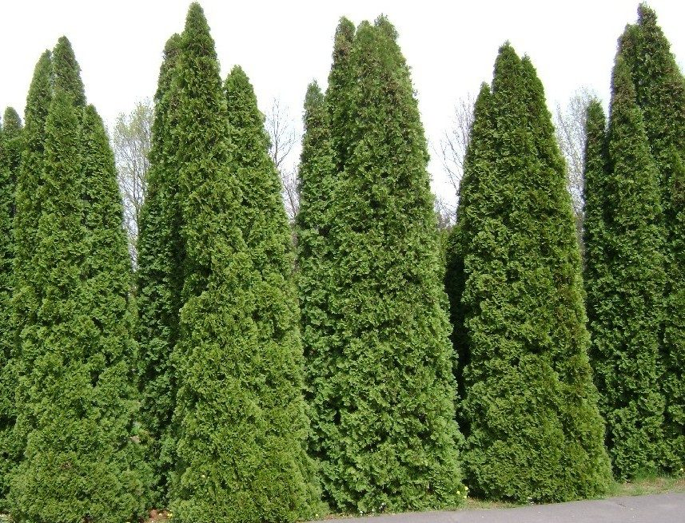

# Northern White Cedar

*Thuja occidentalis*

Thuja occidentalis, also known as northern white-cedar, eastern white-cedar, or arborvitae, is an evergreen coniferous tree, in the cypress family Cupressaceae, which is native to eastern Canada and much of the north-central and northeastern United States. It is widely cultivated as an ornamental plant. It is not to be confused with Juniperus virginiana (eastern red cedar).

## Quick Facts

| | |
|---|---|
| **Scientific name** | *Thuja occidentalis* |
| **Family** | — |
| **Height** | — |
| **Bloom time** | — |
| **Sun** | — |
| **Moisture** | — |
| **Soil** | — |
| **Wildlife value** | — |

## Mentioned In

- [Ecoregions Growing Conditions](../chapters/02-ecoregions-growing-conditions/index.md)

## Image Credits

- Ryan Hodnett (CC BY-SA 4.0)
- Albertyanks Albert Jankowski (Public domain)

## Learn More

- [Wikipedia: Thuja occidentalis](https://en.wikipedia.org/wiki/Thuja_occidentalis)
