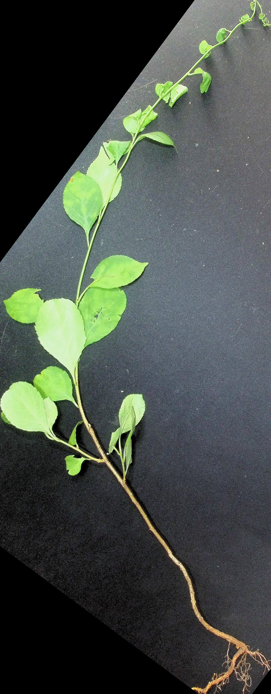
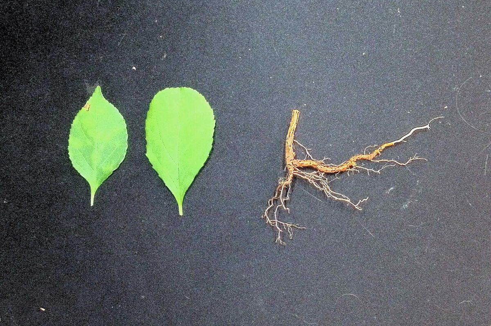

# Oriental Bittersweet

*Celastrus orbiculatus*

Celastrus orbiculatus is a woody vine of the family Celastraceae. It is commonly called Oriental bittersweet, as well as Chinese bittersweet, Asian bittersweet, round-leaved bittersweet, and Asiatic bittersweet. 
It is native to China, where it is the most widely distributed Celastrus species, and to Japan and Korea.

## Quick Facts

| | |
|---|---|
| **Scientific name** | *Celastrus orbiculatus* |
| **Family** | — |
| **Height** | — |
| **Bloom time** | — |
| **Sun** | — |
| **Moisture** | — |
| **Soil** | — |
| **Wildlife value** | — |

## Mentioned In

- [Woodland Forest Plants](../chapters/04-woodland-forest-plants/index.md)

## Image Credits

- Shushimnotrealstooge (CC0)
- Shushimnotrealstooge (CC0)

## Learn More

- [Wikipedia: Celastrus orbiculatus](https://en.wikipedia.org/wiki/Celastrus_orbiculatus)
