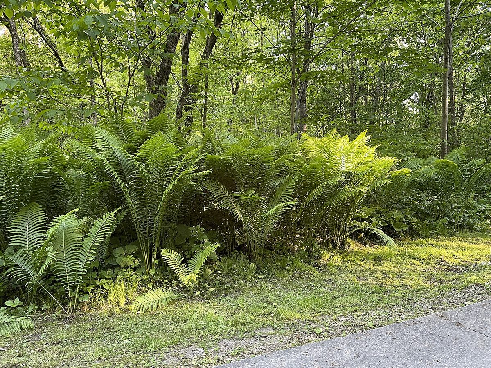

# Ostrich Fern

*Matteuccia struthiopteris*

Matteuccia is a genus of ferns with one species: Matteuccia struthiopteris (common names ostrich fern, fiddlehead fern, or shuttlecock fern). The species epithet struthiopteris comes from Ancient Greek words στρουθίων (strouthíōn) "ostrich" and πτερίς (pterís) "fern".

## Quick Facts

| | |
|---|---|
| **Scientific name** | *Matteuccia struthiopteris* |
| **Family** | — |
| **Height** | — |
| **Bloom time** | — |
| **Sun** | — |
| **Moisture** | — |
| **Soil** | — |
| **Wildlife value** | — |

## Mentioned In

- [Woodland Forest Plants](../chapters/04-woodland-forest-plants/index.md)

## Image Credits

- Nesnad (CC BY 4.0)
- Nichole Ouellette/ouellette001.com (CC BY-SA 4.0)

## Learn More

- [Wikipedia: Matteuccia](https://en.wikipedia.org/wiki/Matteuccia)
