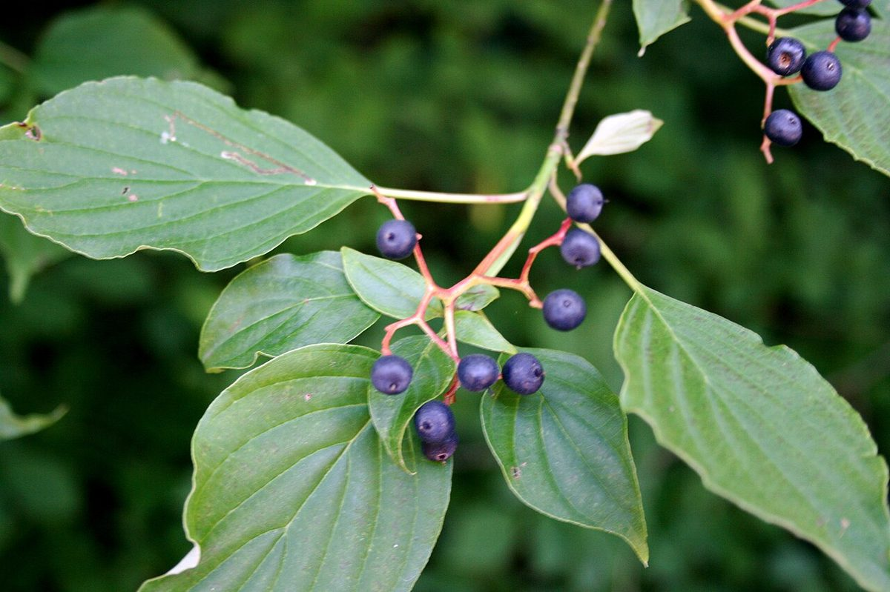

# Pagoda Dogwood

*Cornus alternifolia*

Cornus alternifolia is a species of flowering plant in the dogwood family Cornaceae, native to eastern North America, from Newfoundland west to southern Manitoba and Minnesota, and south to northern Florida and Mississippi. It is rare in the southern United States. It is commonly known as green osier, alternate-leaved dogwood, and pagoda dogwood.

## Quick Facts

| | |
|---|---|
| **Scientific name** | *Cornus alternifolia* |
| **Family** | — |
| **Height** | — |
| **Bloom time** | — |
| **Sun** | — |
| **Moisture** | — |
| **Soil** | — |
| **Wildlife value** | — |

## Mentioned In

- [Woodland Forest Plants](../chapters/04-woodland-forest-plants/index.md)
- [Pollinators Wildlife](../chapters/06-pollinators-wildlife/index.md)

## Image Credits

- Unknown (Public domain)
- Cody Hough (CC BY-SA 3.0)

## Learn More

- [Wikipedia: Cornus alternifolia](https://en.wikipedia.org/wiki/Cornus_alternifolia)
