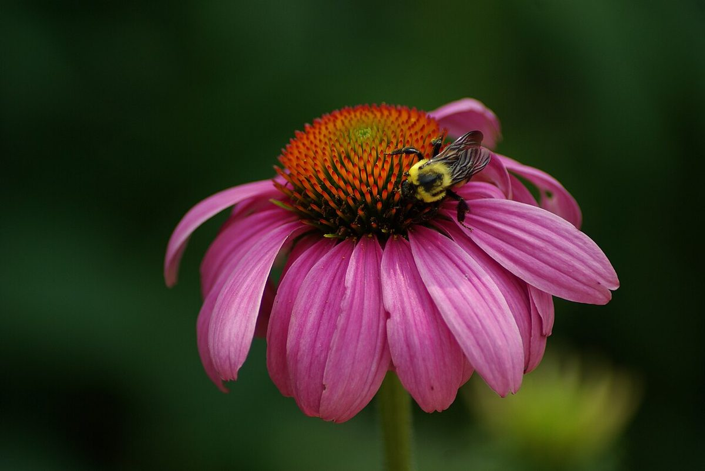
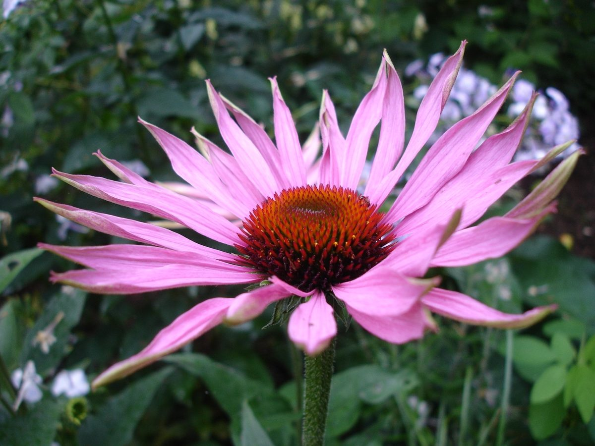

# Pale Purple Coneflower

*Echinacea pallida*

Echinacea  is a genus of herbaceous flowering plants in the daisy family. It has ten species, which are commonly called coneflowers. They are native only in eastern and central North America, where they grow in wet to dry prairies and open wooded areas.

## Quick Facts

| | |
|---|---|
| **Scientific name** | *Echinacea pallida* |
| **Family** | — |
| **Height** | — |
| **Bloom time** | — |
| **Sun** | — |
| **Moisture** | — |
| **Soil** | — |
| **Wildlife value** | — |

## Mentioned In

- [Prairie Plants Grasslands](../chapters/03-prairie-plants-grasslands/index.md)

## Image Credits

- Moxfyre (CC BY-SA 3.0)
- Ulf Eliasson (CC BY 2.5)

## Learn More

- [Wikipedia: Echinacea](https://en.wikipedia.org/wiki/Echinacea)
