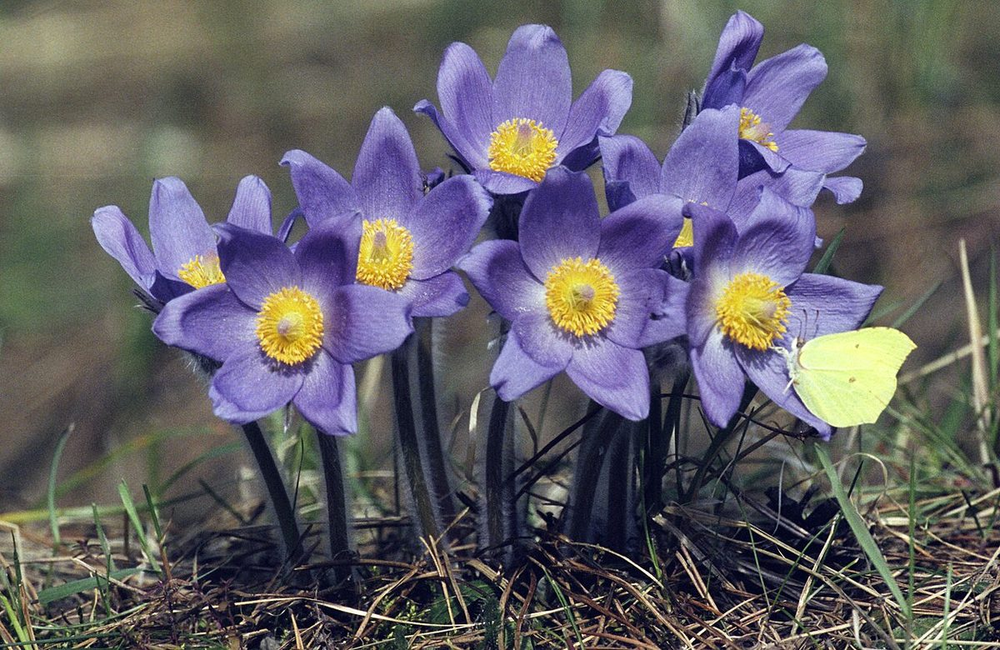
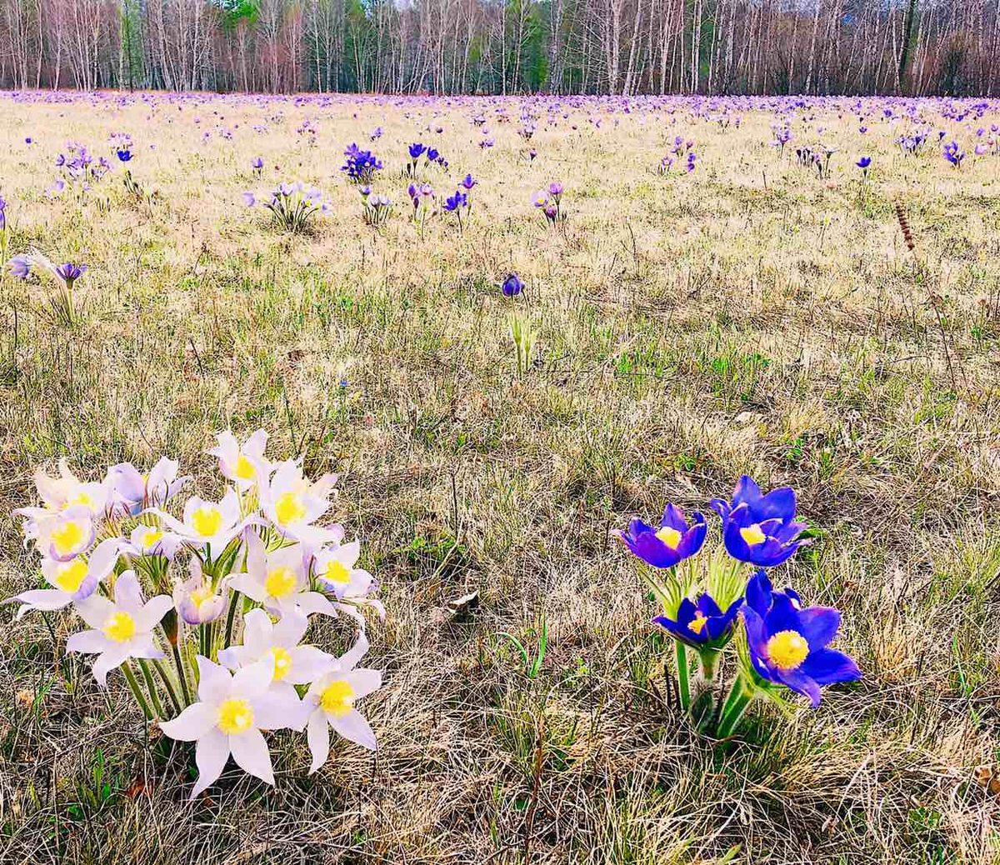

# Pasque Flower

*Anemone patens*

Pulsatilla patens is a species of flowering plant in the family Ranunculaceae, native to Europe, Russia, Mongolia, and China. Common names include Eastern pasqueflower and cutleaf anemone.

## Quick Facts

| | |
|---|---|
| **Scientific name** | *Anemone patens* |
| **Family** | — |
| **Height** | — |
| **Bloom time** | — |
| **Sun** | — |
| **Moisture** | — |
| **Soil** | — |
| **Wildlife value** | — |

## Mentioned In

- [Ecoregions Growing Conditions](../chapters/02-ecoregions-growing-conditions/index.md)
- [Pollinators Wildlife](../chapters/06-pollinators-wildlife/index.md)

## Image Credits

- Jerzy Strzelecki (CC BY-SA 3.0)
- Oleg Bor (CC BY-SA 4.0)

## Learn More

- [Wikipedia: Pulsatilla patens](https://en.wikipedia.org/wiki/Pulsatilla_patens)
