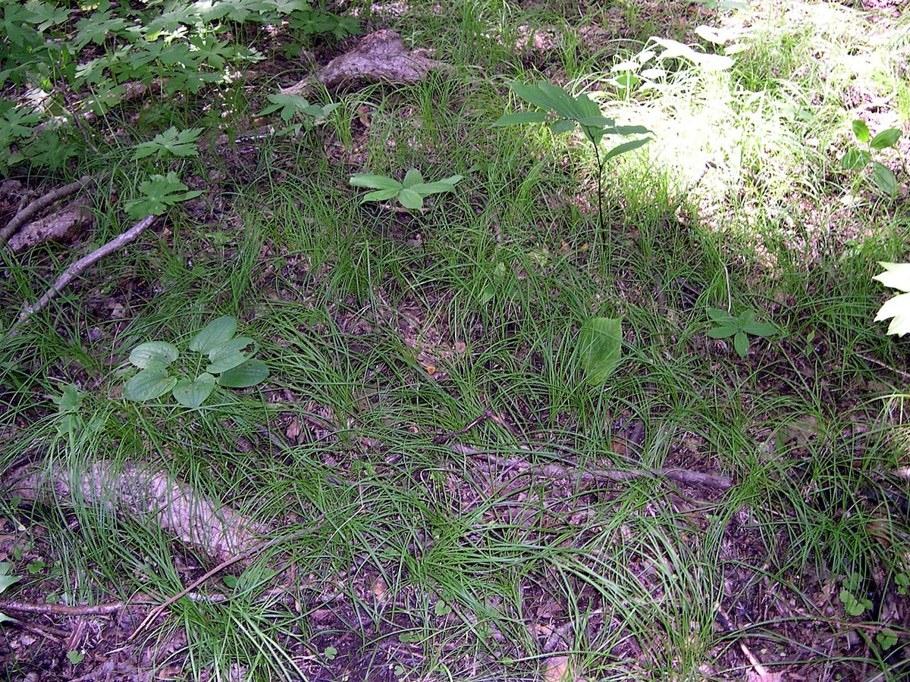

# Pennsylvania Sedge

*Carex pensylvanica*

Carex pensylvanica is a species of flowering plant in the sedge family commonly called Pennsylvania sedge (sometimes shortened to Penn sedge). Other common names include early sedge, common oak sedge, and yellow sedge.

## Quick Facts

| | |
|---|---|
| **Scientific name** | *Carex pensylvanica* |
| **Family** | — |
| **Height** | — |
| **Bloom time** | — |
| **Sun** | — |
| **Moisture** | — |
| **Soil** | — |
| **Wildlife value** | — |

## Mentioned In

- [Plant Identification Skills](../chapters/07-plant-identification-skills/index.md)
- [Garden Design Native Plants](../chapters/10-garden-design-native-plants/index.md)

## Image Credits

- Chhe (talk) (Public domain)
- Jay Sturner from USA (CC BY 2.0)

## Learn More

- [Wikipedia: Carex pensylvanica](https://en.wikipedia.org/wiki/Carex_pensylvanica)
