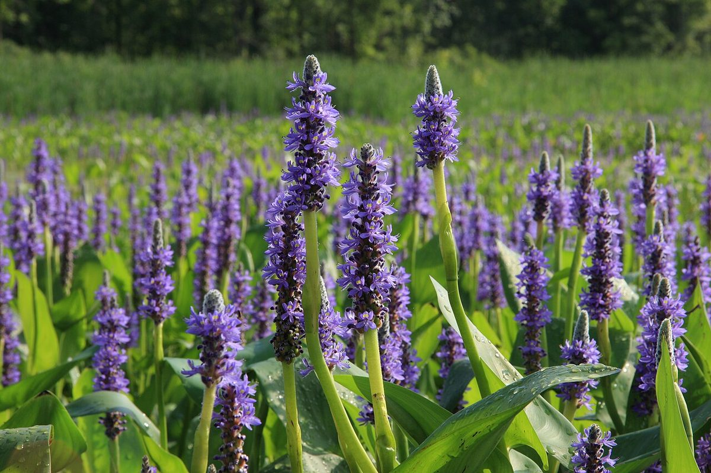

# Pickerelweed

*Pontederia cordata*

Pontederia cordata, common name pickerelweed (USA) or pickerel weed (UK), is a monocotyledonous aquatic plant native to the Americas. It grows in a variety of wetlands, including pond and lake margins across an extremely large range from eastern Canada south to Argentina. A few examples include northern rivers, the Everglades and Louisiana.

## Quick Facts

| | |
|---|---|
| **Scientific name** | *Pontederia cordata* |
| **Family** | — |
| **Height** | — |
| **Bloom time** | — |
| **Sun** | — |
| **Moisture** | — |
| **Soil** | — |
| **Wildlife value** | — |

## Mentioned In

- [Wetland Shoreline Plants](../chapters/05-wetland-shoreline-plants/index.md)

## Image Credits

- D. Gordon E. Robertson (CC BY-SA 3.0)
- Cephas (CC BY-SA 3.0)

## Learn More

- [Wikipedia: Pontederia cordata](https://en.wikipedia.org/wiki/Pontederia_cordata)
