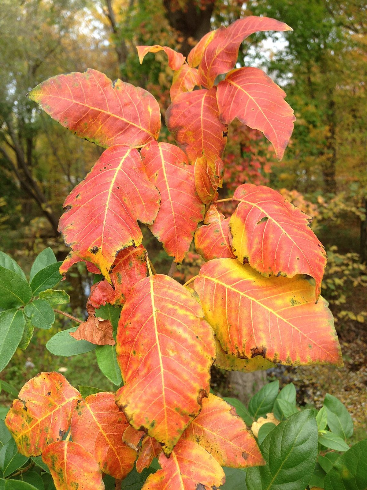
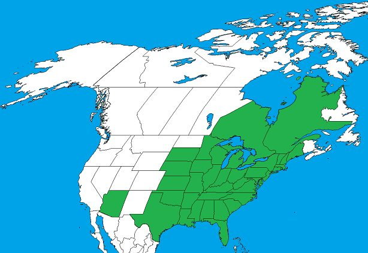

# Poison Ivy

*Toxicodendron radicans*

Toxicodendron radicans, commonly known as eastern poison ivy or poison ivy, is a species of allergenic flowering plant. It has numerous subtaxons and forms both vines and shrubs. Despite its common name, it is not a true ivy, but rather a member of the cashew and sumac family, Anacardiaceae.

## Quick Facts

| | |
|---|---|
| **Scientific name** | *Toxicodendron radicans* |
| **Family** | — |
| **Height** | — |
| **Bloom time** | — |
| **Sun** | — |
| **Moisture** | — |
| **Soil** | — |
| **Wildlife value** | — |

## Mentioned In

- [Woodland Forest Plants](../chapters/04-woodland-forest-plants/index.md)

## Image Credits

- Famartin (CC BY-SA 4.0)
- Coinmanj (CC BY-SA 4.0)

## Learn More

- [Wikipedia: Toxicodendron radicans](https://en.wikipedia.org/wiki/Toxicodendron_radicans)
