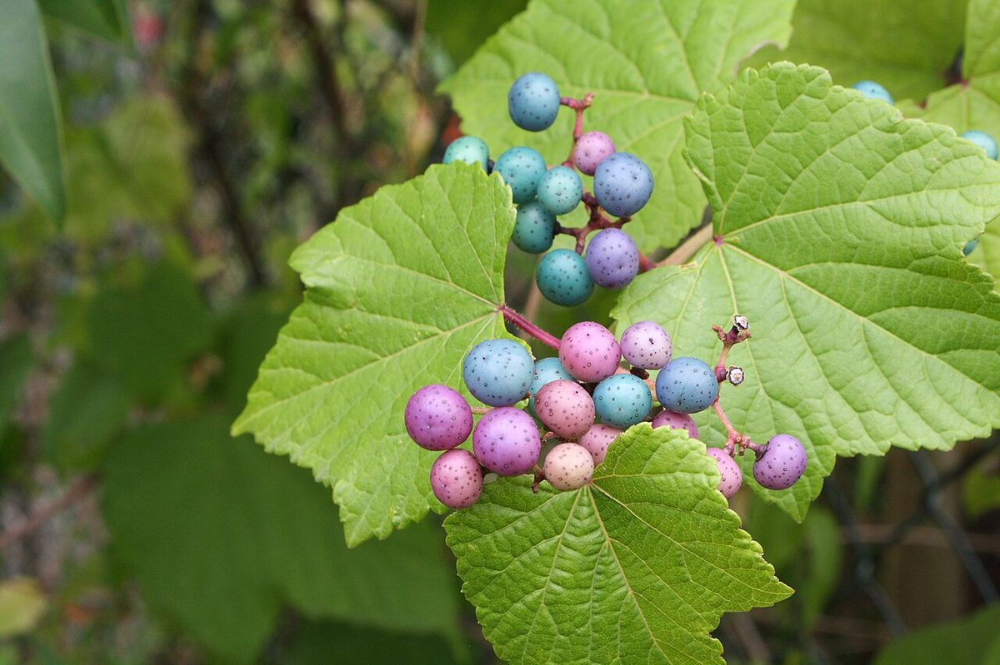
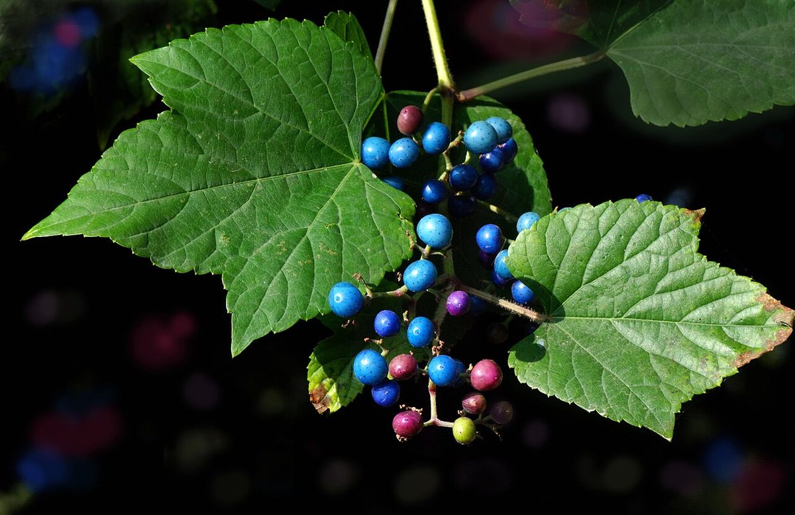

# Porcelain Berry

*Ampelopsis brevipedunculata*

Ampelopsis glandulosa, with common names creeper, porcelain berry, Amur peppervine, and wild grape, is a plant in the Vitaceae (grape) family, native to temperate areas of Asia, including China, Japan, India, Nepal, Myanmar, Vietnam, and the Philippines.
It is commonly used as an ornamental plant, but is considered invasive outside of its native range.  Ampelopsis glandulosa is generally similar to, and potentially confused with, grape species (genus Vitis) and other Ampelopsis species.

## Quick Facts

| | |
|---|---|
| **Scientific name** | *Ampelopsis brevipedunculata* |
| **Family** | — |
| **Height** | — |
| **Bloom time** | — |
| **Sun** | — |
| **Moisture** | — |
| **Soil** | — |
| **Wildlife value** | — |

## Mentioned In

- [Plant Identification Skills](../chapters/07-plant-identification-skills/index.md)

## Image Credits

- Olivier Vanpé (CC BY-SA 3.0)
- Pancrat (CC BY-SA 3.0)

## Learn More

- [Wikipedia: Ampelopsis glandulosa](https://en.wikipedia.org/wiki/Ampelopsis_glandulosa)
