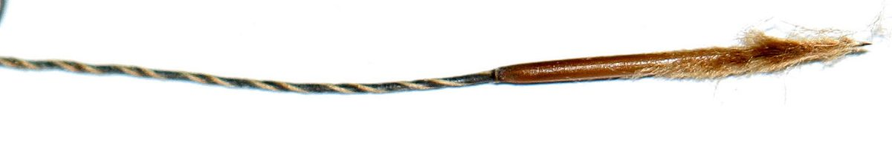

# Porcupine Grass

*Hesperostipa spartea*

Hesperostipa spartea, formerly Stipa spartea,  is a species of grass known by the common names porcupine grass, western porcupine grass, short-awn porcupine grass, porcupine needlegrass, and big needlegrass. It is native to North America, where it is widespread from British Columbia to Ontario in Canada and through the central and Great Lakes regions of the United States. It is a bunchgrass species in the genus Hesperostipa.

## Quick Facts

| | |
|---|---|
| **Scientific name** | *Hesperostipa spartea* |
| **Family** | — |
| **Height** | — |
| **Bloom time** | — |
| **Sun** | — |
| **Moisture** | — |
| **Soil** | — |
| **Wildlife value** | — |

## Mentioned In

- [Prairie Plants Grasslands](../chapters/03-prairie-plants-grasslands/index.md)

## Image Credits

- USFWS Mountain-Prairie (Public domain)
- Hardyplants at English Wikipedia (CC BY 2.5)

## Learn More

- [Wikipedia: Hesperostipa spartea](https://en.wikipedia.org/wiki/Hesperostipa_spartea)
