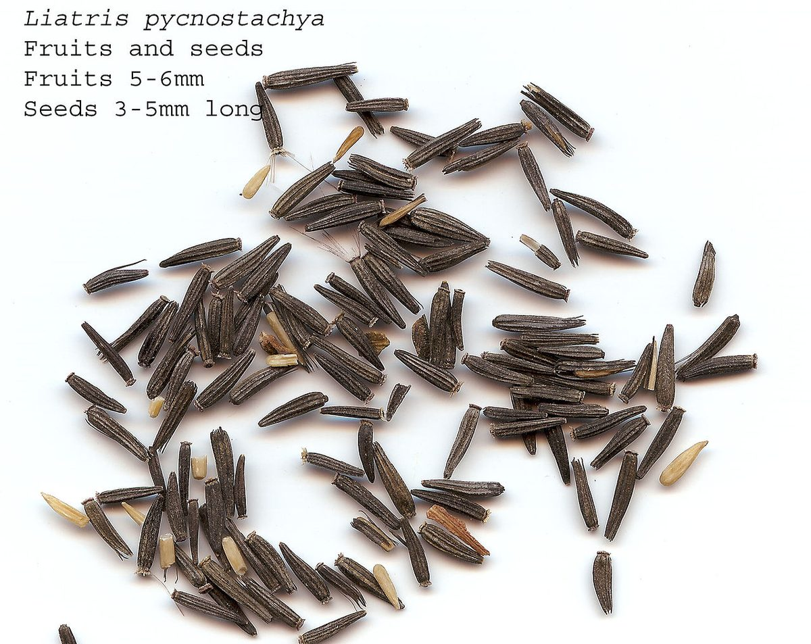

# Prairie Blazing Star

*Liatris pycnostachya*

Liatris pycnostachya, the prairie blazing star, cattail gayfeather, Kansas gayfeather, or cattail blazing star, is a perennial plant in the Asteraceae family that is native to the tallgrass prairies of the central United States.

## Quick Facts

| | |
|---|---|
| **Scientific name** | *Liatris pycnostachya* |
| **Family** | — |
| **Height** | — |
| **Bloom time** | — |
| **Sun** | — |
| **Moisture** | — |
| **Soil** | — |
| **Wildlife value** | — |

## Mentioned In

- [Prairie Plants Grasslands](../chapters/03-prairie-plants-grasslands/index.md)
- [Wetland Shoreline Plants](../chapters/05-wetland-shoreline-plants/index.md)
- [Ecological Restoration](../chapters/12-ecological-restoration/index.md)

## Image Credits

- Eric Hunt (CC BY-SA 4.0)
- Hardyplants at English Wikipedia (Public domain)

## Learn More

- [Wikipedia: Liatris pycnostachya](https://en.wikipedia.org/wiki/Liatris_pycnostachya)
