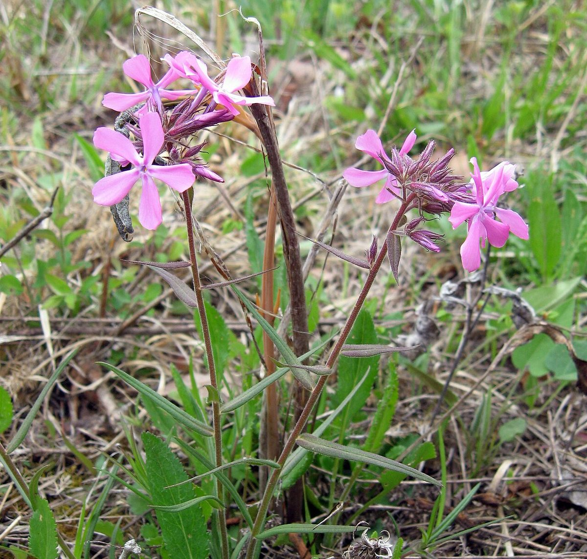

# Prairie Phlox

*Phlox pilosa*

Phlox pilosa, the downy phlox or prairie phlox, is an herbaceous plant in the family Polemoniaceae.  It is native to eastern North America, where it is found in open areas such as prairies and woodlands.

## Quick Facts

| | |
|---|---|
| **Scientific name** | *Phlox pilosa* |
| **Family** | — |
| **Height** | — |
| **Bloom time** | — |
| **Sun** | — |
| **Moisture** | — |
| **Soil** | — |
| **Wildlife value** | — |

## Mentioned In

- [Ecological Restoration](../chapters/12-ecological-restoration/index.md)

## Image Credits

- Joshua Mayer (CC BY-SA 2.0)
- Mason Brock (Masebrock) (Public domain)

## Learn More

- [Wikipedia: Phlox pilosa](https://en.wikipedia.org/wiki/Phlox_pilosa)
