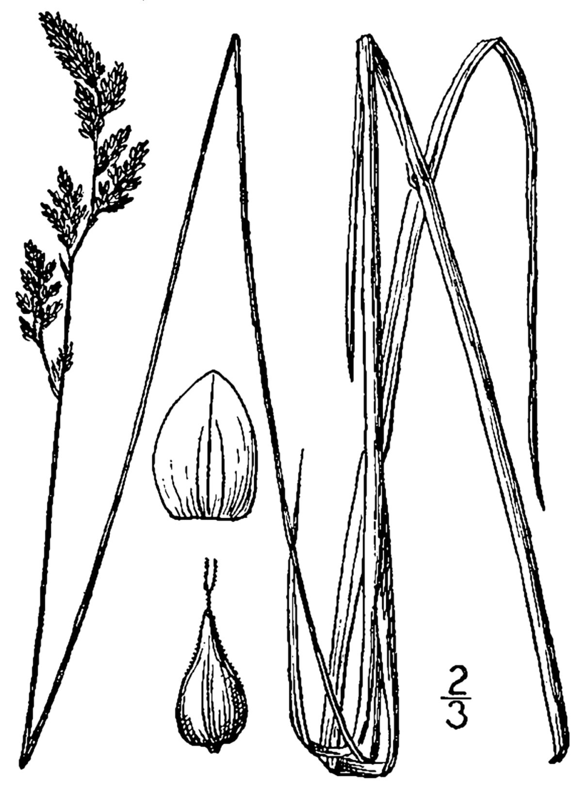

# Prairie Sedge

*Carex prairea*

Carex prairea, common name prairie sedge, is a species of Carex native to North America.

## Quick Facts

| | |
|---|---|
| **Scientific name** | *Carex prairea* |
| **Family** | — |
| **Height** | — |
| **Bloom time** | — |
| **Sun** | — |
| **Moisture** | — |
| **Soil** | — |
| **Wildlife value** | — |

## Mentioned In

- [Prairie Plants Grasslands](../chapters/03-prairie-plants-grasslands/index.md)

## Image Credits

- Ivar Leidus (CC BY-SA 4.0)
- Britton, N.L., and A. Brown. 1913. An illustrated flora of the northern United States, Canada and the British Possessions. 3 vols. Charles Scribner's Sons, New York. Vol. 1: 370. Courtesy of Kentucky (Public domain)

## Learn More

- [Wikipedia: Carex prairea](https://en.wikipedia.org/wiki/Carex_prairea)
