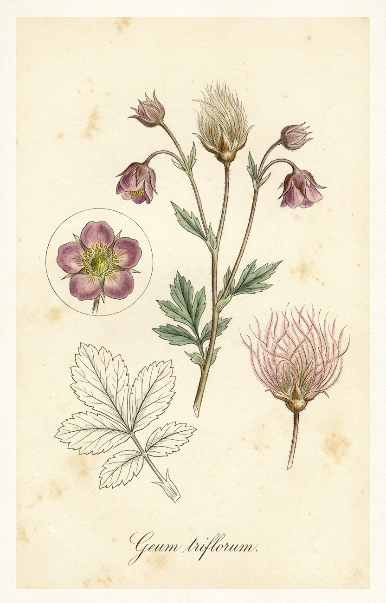
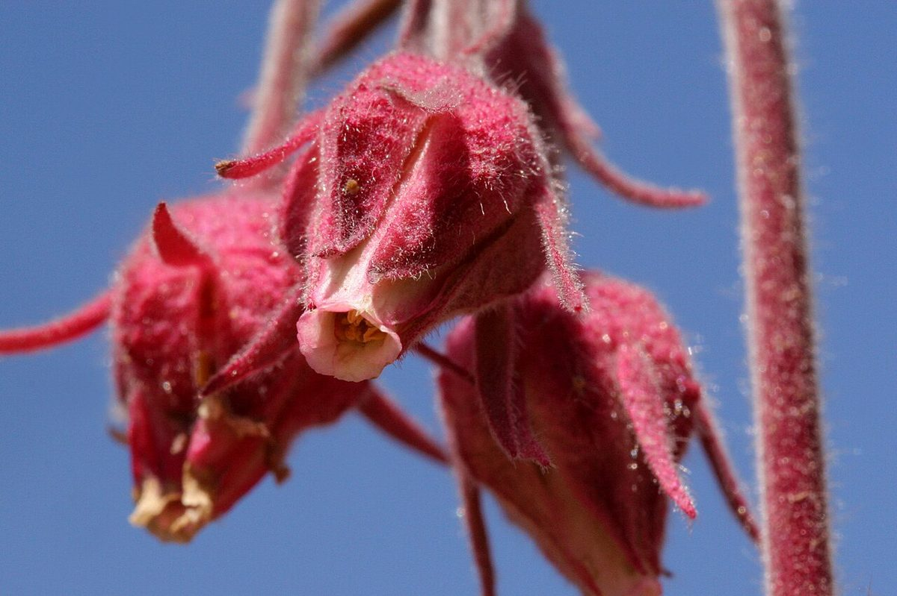

# Prairie Smoke

*Geum triflorum*

{ .plant-illustration }

*Botanical plate of* **Geum triflorum** *— Curtis-style illustration.*

Geum triflorum, commonly known as prairie smoke, old man's whiskers, or three-flowered avens, is a spring-blooming perennial herbaceous plant of the Rosaceae family. It is a hemiboreal continental climate species that is widespread in colder and drier environments of western North America, although it does occur in isolated populations as far east as New York and Ontario. It is particularly known for the long feathery plumes on the seed heads that have inspired many of the regional common names and aid in wind dispersal of its seeds.

## Quick Facts

| | |
|---|---|
| **Scientific name** | *Geum triflorum* |
| **Family** | — |
| **Height** | — |
| **Bloom time** | — |
| **Sun** | — |
| **Moisture** | — |
| **Soil** | — |
| **Wildlife value** | — |

## Mentioned In

- [Garden Design Native Plants](../chapters/10-garden-design-native-plants/index.md)
- [Ecological Restoration](../chapters/12-ecological-restoration/index.md)

## Image Credits

- Matt Lavin from Bozeman, Montana, USA (CC BY-SA 2.0)
- Patrick Alexander from Las Cruces, NM (CC0)

## Learn More

- [Wikipedia: Geum triflorum](https://en.wikipedia.org/wiki/Geum_triflorum)
