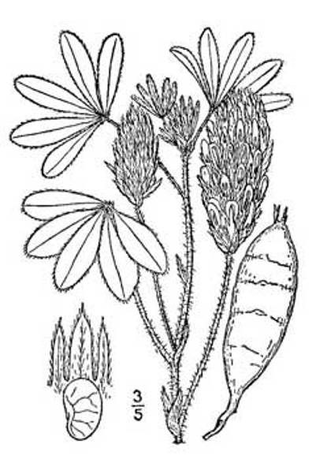

# Prairie Turnip

*Psoralea esculenta*

Pediomelum esculentum, synonym Psoralea esculenta, common name prairie turnip or timpsila, is an herbaceous perennial plant native to prairies and dry woodlands of central North America, which bears a starchy tuberous root edible as a root vegetable. English names for the plant include tipsin, teepsenee, breadroot, breadroot scurf pea, large Indian breadroot, prairie potato and pomme blanche.  The prairie turnip continues to be a staple food of the Plains Indians.

## Quick Facts

| | |
|---|---|
| **Scientific name** | *Psoralea esculenta* |
| **Family** | — |
| **Height** | — |
| **Bloom time** | — |
| **Sun** | — |
| **Moisture** | — |
| **Soil** | — |
| **Wildlife value** | — |

## Mentioned In

- [Cultural Indigenous Uses](../chapters/13-cultural-indigenous-uses/index.md)

## Image Credits

- Rheanna Kautzman (Public domain)
- Unknown authorUnknown author (Public domain)

## Learn More

- [Wikipedia: Pediomelum esculentum](https://en.wikipedia.org/wiki/Pediomelum_esculentum)
