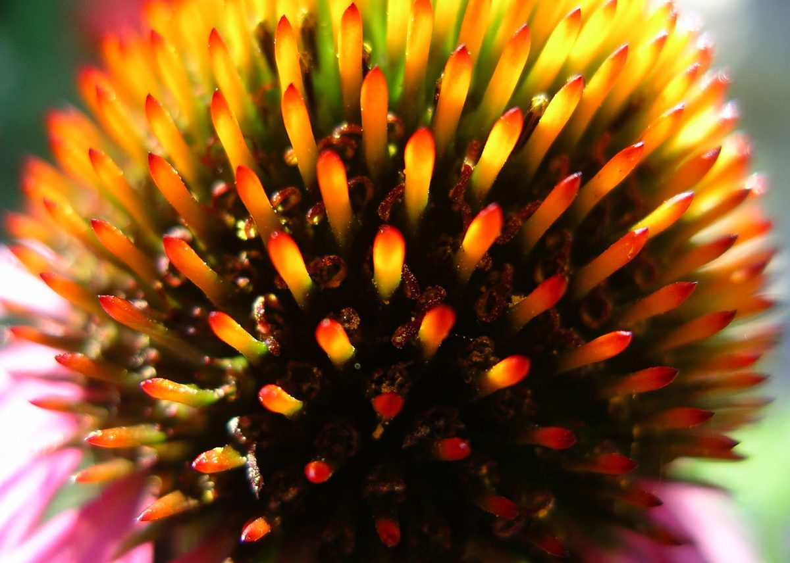

# Purple Coneflower

*Echinacea purpurea*

Echinacea purpurea, the eastern purple coneflower, purple coneflower, hedgehog coneflower, or Echinacea, is a North American species of flowering plant in the family Asteraceae. It is native to parts of eastern North America and present to some extent in the wild in much of the eastern, southeastern and midwestern United States, as well as in the Canadian Province of Ontario. It is most common in the Ozarks, the Mississippi Valley, and the Ohio Valley.

## Quick Facts

| | |
|---|---|
| **Scientific name** | *Echinacea purpurea* |
| **Family** | — |
| **Height** | — |
| **Bloom time** | — |
| **Sun** | — |
| **Moisture** | — |
| **Soil** | — |
| **Wildlife value** | — |

## Mentioned In

- [Prairie Plants Grasslands](../chapters/03-prairie-plants-grasslands/index.md)
- [Pollinators Wildlife](../chapters/06-pollinators-wildlife/index.md)
- [Garden Design Native Plants](../chapters/10-garden-design-native-plants/index.md)
- [Planting Maintenance Sourcing](../chapters/11-planting-maintenance-sourcing/index.md)

## Image Credits

- Quercus2018 (CC BY-SA 4.0)
- Darrell.barrell at English Wikipedia (Public domain)

## Learn More

- [Wikipedia: Echinacea purpurea](https://en.wikipedia.org/wiki/Echinacea_purpurea)
