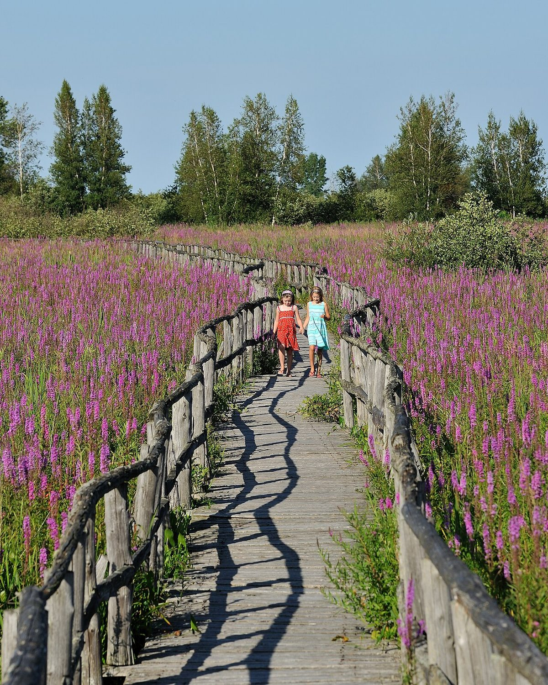

# Purple Loosestrife

*Lythrum salicaria*

Lythrum salicaria or purple-loosestrife is a flowering plant belonging to the family Lythraceae. It should not be confused with other plants sharing the name loosestrife that are members of the genus Lysimachia in the family Primulaceae. This herbaceous perennial plant is native to temperate regions of Europe, Asia, northern Africa, and eastern Australia.

## Quick Facts

| | |
|---|---|
| **Scientific name** | *Lythrum salicaria* |
| **Family** | — |
| **Height** | — |
| **Bloom time** | — |
| **Sun** | — |
| **Moisture** | — |
| **Soil** | — |
| **Wildlife value** | — |

## Mentioned In

- [Invasive Species Id](../chapters/08-invasive-species-id/index.md)

## Image Credits

- Ivar Leidus (CC BY-SA 4.0)
- Saffron Blaze (CC BY-SA 3.0)

## Learn More

- [Wikipedia: Lythrum salicaria](https://en.wikipedia.org/wiki/Lythrum_salicaria)
