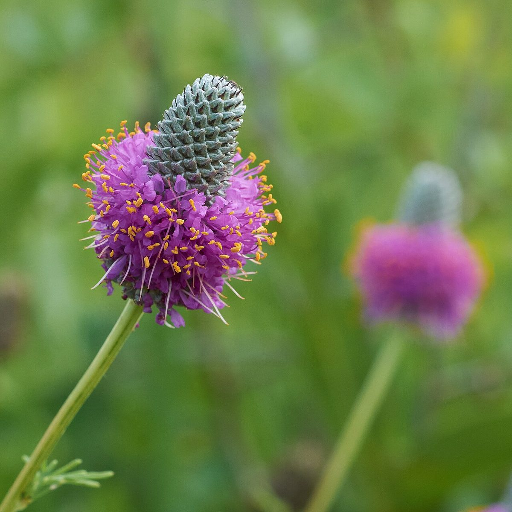

# Purple Prairie Clover

*Dalea purpurea*

Dalea purpurea is a species of flowering plant in the legume family known as purple prairie clover. Native to central North America, purple prairie clover is a relatively common member of the Great Plains and prairie ecosystems. It blooms in the summer with dense spikes of bright purple flowers that attract many species of insects.

## Quick Facts

| | |
|---|---|
| **Scientific name** | *Dalea purpurea* |
| **Family** | — |
| **Height** | — |
| **Bloom time** | — |
| **Sun** | — |
| **Moisture** | — |
| **Soil** | — |
| **Wildlife value** | — |

## Mentioned In

- [Prairie Plants Grasslands](../chapters/03-prairie-plants-grasslands/index.md)

## Image Credits

- Eric Hunt (CC BY-SA 4.0)

## Learn More

- [Wikipedia: Dalea purpurea](https://en.wikipedia.org/wiki/Dalea_purpurea)
