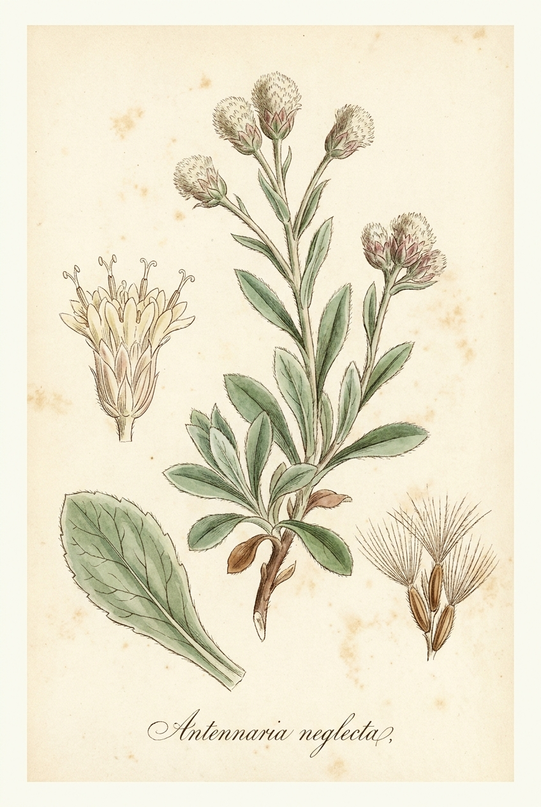

# Pussytoes

*Antennaria neglecta*

{ .plant-illustration }

*Botanical plate of* **Antennaria neglecta** *— Curtis-style illustration.*

Antennaria neglecta  is a North American species of flowering plants in the family Asteraceae known by the common name field pussytoes. It is widespread across much of Canada (including Northwest Territories plus all provinces except Newfoundland and Labrador) as well as the northeastern and north-central United States.
Antennaria neglecta  is an herb up to 25 cm (10 inches) tall with as many as 8 flowering heads per plant.

## Quick Facts

| | |
|---|---|
| **Scientific name** | *Antennaria neglecta* |
| **Family** | — |
| **Height** | — |
| **Bloom time** | — |
| **Sun** | — |
| **Moisture** | — |
| **Soil** | — |
| **Wildlife value** | — |

## Mentioned In

- [Pollinators Wildlife](../chapters/06-pollinators-wildlife/index.md)
- [Garden Design Native Plants](../chapters/10-garden-design-native-plants/index.md)

## Image Credits

- El Grafo (CC BY-SA 3.0)

## Learn More

- [Wikipedia: Antennaria neglecta](https://en.wikipedia.org/wiki/Antennaria_neglecta)
