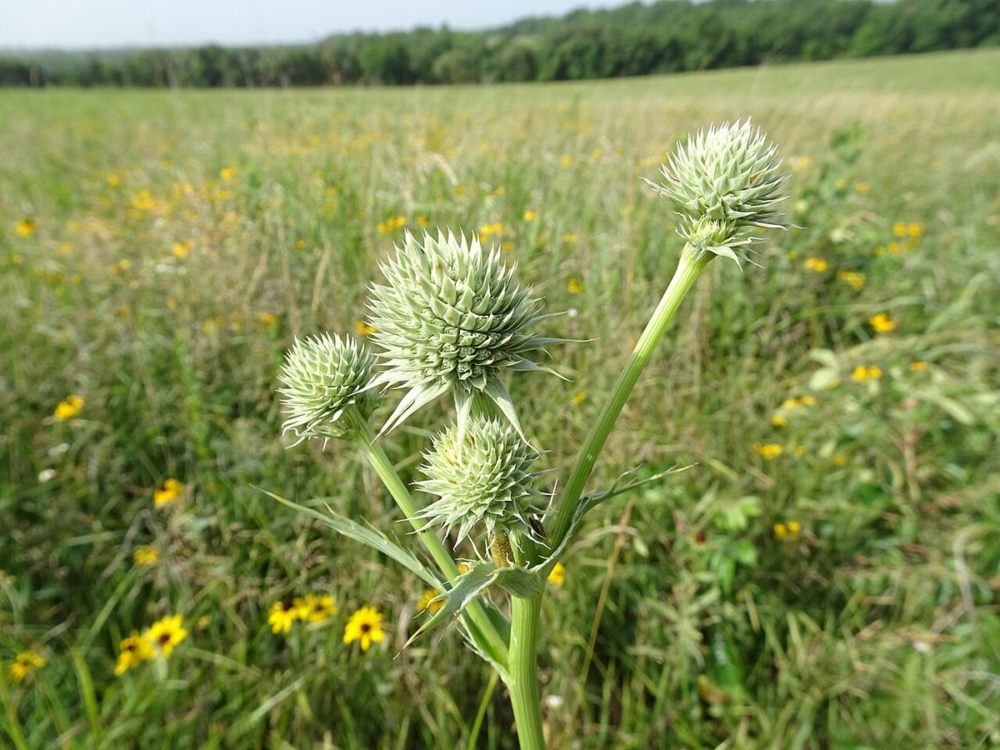

# Rattlesnake Master

*Eryngium yuccifolium*

Eryngium yuccifolium, known as rattlesnake master, button eryngo, and button snake-root, is a perennial herb of the parsley family native to the tallgrass prairies of central and eastern North America. It grows from Minnesota east to Ohio and south to Texas and Florida, including a few spots in Connecticut, New Jersey, Maryland, and Delaware. There are two varieties found in the wild, the northern rattlesnake master (Eryngium yuccifolium var.

## Quick Facts

| | |
|---|---|
| **Scientific name** | *Eryngium yuccifolium* |
| **Family** | — |
| **Height** | — |
| **Bloom time** | — |
| **Sun** | — |
| **Moisture** | — |
| **Soil** | — |
| **Wildlife value** | — |

## Mentioned In

- [Ecological Restoration](../chapters/12-ecological-restoration/index.md)

## Image Credits

- Eric Hunt (CC BY-SA 4.0)
- Thomas Koffel (CC BY 4.0)

## Learn More

- [Wikipedia: Eryngium yuccifolium](https://en.wikipedia.org/wiki/Eryngium_yuccifolium)
