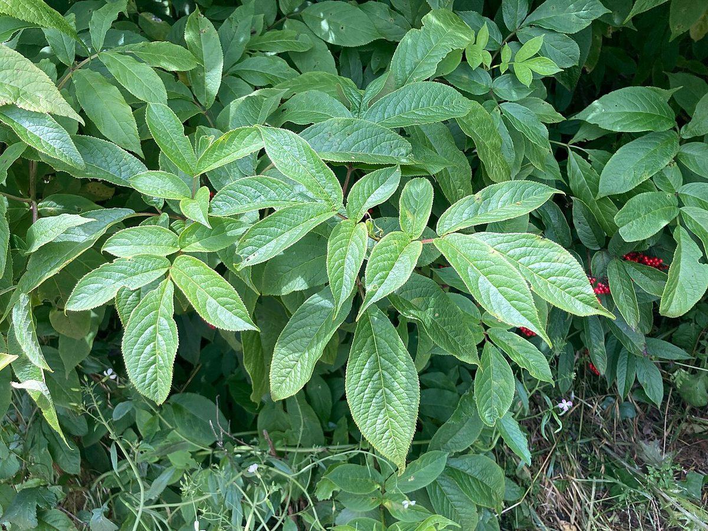

# Red-berried Elder

*Sambucus racemosa*

Sambucus racemosa is a species of elder known by the common names red-berried elder and red elderberry. It produces a red drupe.
The species is native across much of the Northern Hemisphere.

## Quick Facts

| | |
|---|---|
| **Scientific name** | *Sambucus racemosa* |
| **Family** | — |
| **Height** | — |
| **Bloom time** | — |
| **Sun** | — |
| **Moisture** | — |
| **Soil** | — |
| **Wildlife value** | — |

## Mentioned In

- [Woodland Forest Plants](../chapters/04-woodland-forest-plants/index.md)

## Image Credits

- Jean-Pol GRANDMONT (CC BY-SA 3.0)
- Awinch1001 (CC0)

## Learn More

- [Wikipedia: Sambucus racemosa](https://en.wikipedia.org/wiki/Sambucus_racemosa)
