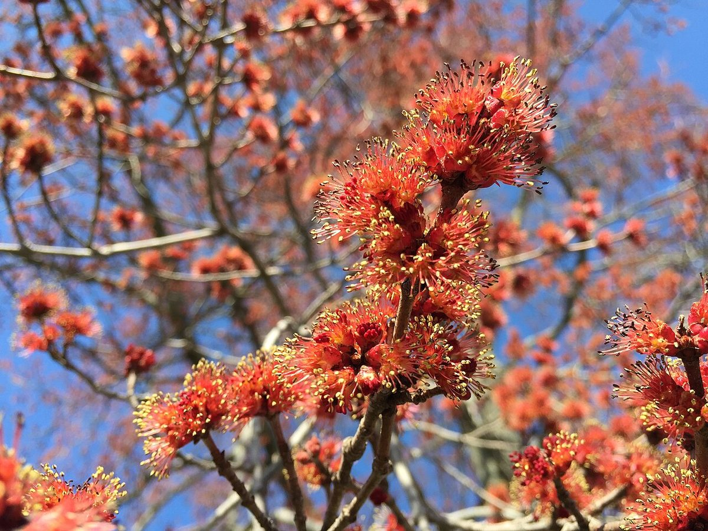

# Red Maple

*Acer rubrum*

Acer rubrum, the red maple, also known as swamp maple, water maple, or soft maple, is one of the most common and widespread deciduous trees of eastern and central North America. The U.S. Forest Service recognizes it as the most abundant native tree in eastern North America. The red maple ranges from southeastern Manitoba around the Lake of the Woods on the border with Ontario and Minnesota, east to Newfoundland, south to Florida, and southwest to East Texas.

## Quick Facts

| | |
|---|---|
| **Scientific name** | *Acer rubrum* |
| **Family** | — |
| **Height** | — |
| **Bloom time** | — |
| **Sun** | — |
| **Moisture** | — |
| **Soil** | — |
| **Wildlife value** | — |

## Mentioned In

- [Woodland Forest Plants](../chapters/04-woodland-forest-plants/index.md)
- [Ecological Restoration](../chapters/12-ecological-restoration/index.md)

## Image Credits

- Famartin (CC BY-SA 4.0)
- Famartin (CC BY-SA 4.0)

## Learn More

- [Wikipedia: Acer rubrum](https://en.wikipedia.org/wiki/Acer_rubrum)
