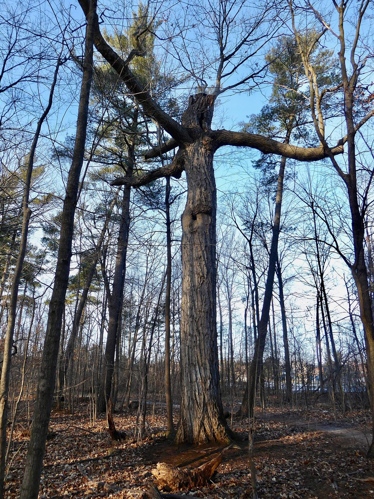

# Red Oak

*Quercus rubra*

Quercus rubra, the northern red oak or common red oak, is an oak tree in the red oak group (Quercus section Lobatae). It is a native of North America, in the eastern and central United States and southeast and south-central Canada. It has been introduced to small areas in Western Europe, where it can frequently be seen cultivated in gardens and parks.

## Quick Facts

| | |
|---|---|
| **Scientific name** | *Quercus rubra* |
| **Family** | — |
| **Height** | — |
| **Bloom time** | — |
| **Sun** | — |
| **Moisture** | — |
| **Soil** | — |
| **Wildlife value** | — |

## Mentioned In

- [Ecoregions Growing Conditions](../chapters/02-ecoregions-growing-conditions/index.md)
- [Woodland Forest Plants](../chapters/04-woodland-forest-plants/index.md)

## Image Credits

- Famartin (CC BY-SA 4.0)
- Bay & Gables (CC BY-SA 4.0)

## Learn More

- [Wikipedia: Quercus rubra](https://en.wikipedia.org/wiki/Quercus_rubra)
