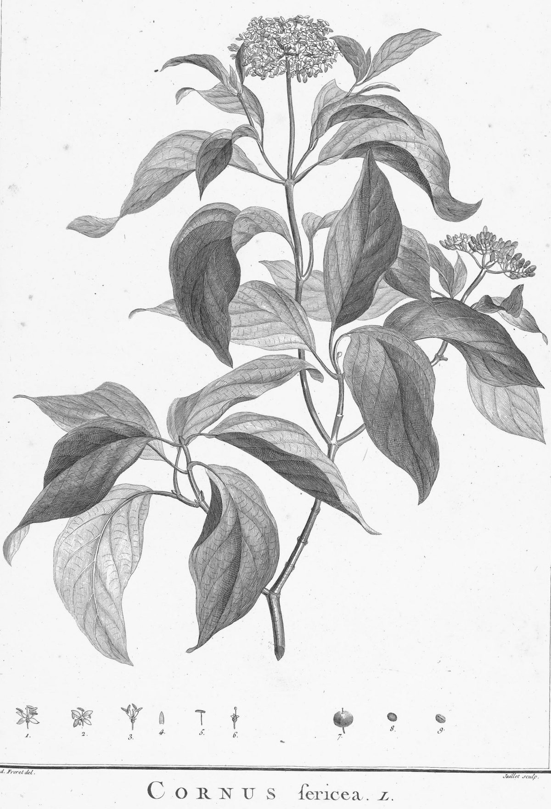

# Red-osier Dogwood

*Cornus sericea*

Cornus sericea, the red osier or red-osier dogwood, is a species of flowering plant in the family Cornaceae, native to much of North America. It has sometimes been considered a synonym of the Asian species Cornus alba. Other names include red brush, red willow, redstem dogwood, redtwig dogwood, red-rood, American dogwood, creek dogwood, and western dogwood.

## Quick Facts

| | |
|---|---|
| **Scientific name** | *Cornus sericea* |
| **Family** | — |
| **Height** | — |
| **Bloom time** | — |
| **Sun** | — |
| **Moisture** | — |
| **Soil** | — |
| **Wildlife value** | — |

## Mentioned In

- [Wetland Shoreline Plants](../chapters/05-wetland-shoreline-plants/index.md)

## Image Credits

- No machine-readable author provided. Jkelly assumed (based on copyright claims). (CC BY-SA 3.0)
- Charles Louis L'Héritier, Dom. de Brutelle (Public domain)

## Learn More

- [Wikipedia: Cornus sericea](https://en.wikipedia.org/wiki/Cornus_sericea)
