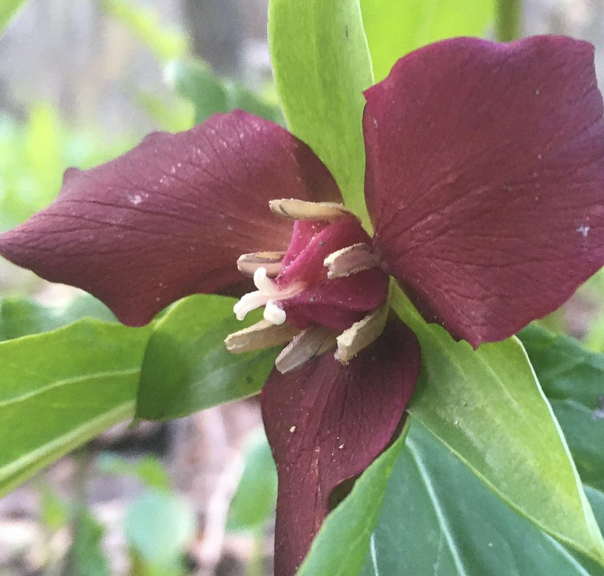
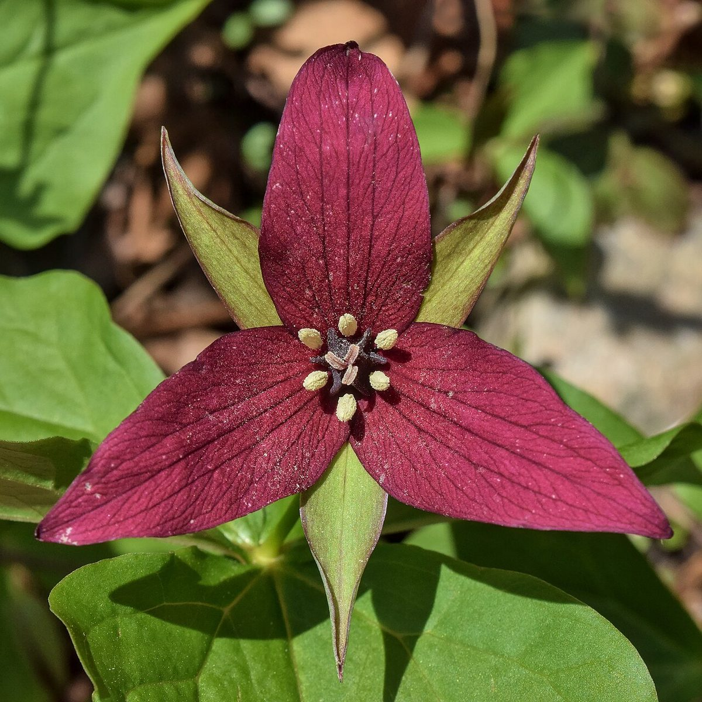

# Red Trillium

*Trillium erectum*

Trillium erectum, the red trillium, also known as wake robin, purple trillium, bethroot, or stinking benjamin, is a species of flowering plant in the family Melanthiaceae. The plant takes its common name "wake robin" by analogy with the European robin, which has a red breast heralding spring. Likewise Trillium erectum is a spring ephemeral plant whose life-cycle is synchronized with that of the forests in which it lives.

## Quick Facts

| | |
|---|---|
| **Scientific name** | *Trillium erectum* |
| **Family** | — |
| **Height** | — |
| **Bloom time** | — |
| **Sun** | — |
| **Moisture** | — |
| **Soil** | — |
| **Wildlife value** | — |

## Mentioned In

- [Woodland Forest Plants](../chapters/04-woodland-forest-plants/index.md)

## Image Credits

- Geoffrey.landis (CC BY-SA 4.0)
- The Cosmonaut (CC BY-SA 2.5 ca)

## Learn More

- [Wikipedia: Trillium erectum](https://en.wikipedia.org/wiki/Trillium_erectum)
