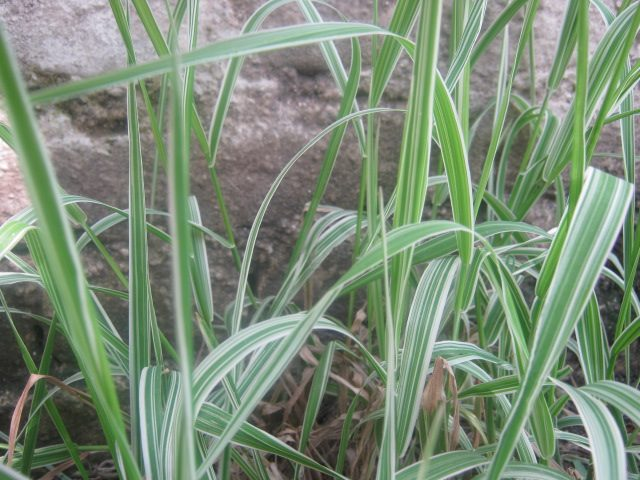

# Reed Canary Grass

*Phalaris arundinacea*

Phalaris arundinacea, or reed canary grass, is a tall, perennial grass that commonly forms extensive single-species stands along the margins of lakes and streams and in wet open areas, with a wide distribution in Europe, Asia, northern Africa and North America. Other common names for the plant include gardener's-garters and ribbon grass in English, alpiste roseau in French, Rohrglanzgras in German, kusa-yoshi in Japanese, caniço-malhado in Portuguese, and hierba cinta and pasto cinto in Spanish.

## Quick Facts

| | |
|---|---|
| **Scientific name** | *Phalaris arundinacea* |
| **Family** | — |
| **Height** | — |
| **Bloom time** | — |
| **Sun** | — |
| **Moisture** | — |
| **Soil** | — |
| **Wildlife value** | — |

## Mentioned In

- [Invasive Species Id](../chapters/08-invasive-species-id/index.md)

## Image Credits

- Franz Xaver (CC BY-SA 3.0)
- Krish Dulal (CC BY-SA 3.0)

## Learn More

- [Wikipedia: Phalaris arundinacea](https://en.wikipedia.org/wiki/Phalaris_arundinacea)
