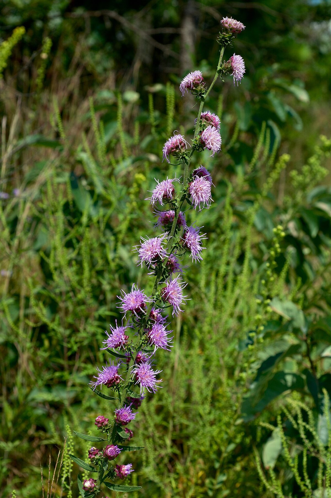

# Rough Blazing Star

*Liatris aspera*

Liatris aspera (known as rough blazing star, button blazing star, lacerate blazing star, tall prairie blazing star, or tall gayfeather) is a perennial wildflower in the Asteraceae family that is found in central to eastern North America in habitats that range from mesic to dry prairie and dry savanna.

## Quick Facts

| | |
|---|---|
| **Scientific name** | *Liatris aspera* |
| **Family** | — |
| **Height** | — |
| **Bloom time** | — |
| **Sun** | — |
| **Moisture** | — |
| **Soil** | — |
| **Wildlife value** | — |

## Mentioned In

- [Prairie Plants Grasslands](../chapters/03-prairie-plants-grasslands/index.md)
- [Ecological Restoration](../chapters/12-ecological-restoration/index.md)

## Image Credits

- Crazytwoknobs (CC BY 3.0)
- Eric Hunt (CC BY-SA 4.0)

## Learn More

- [Wikipedia: Liatris aspera](https://en.wikipedia.org/wiki/Liatris_aspera)
