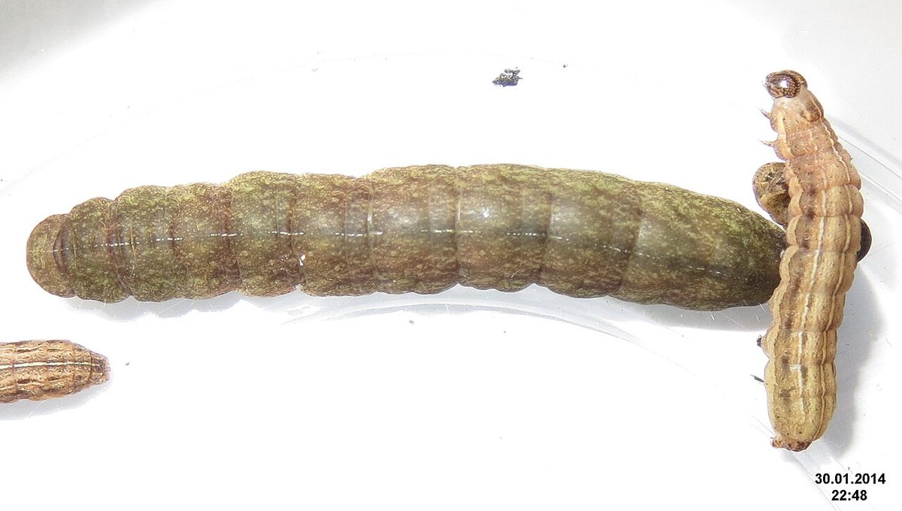
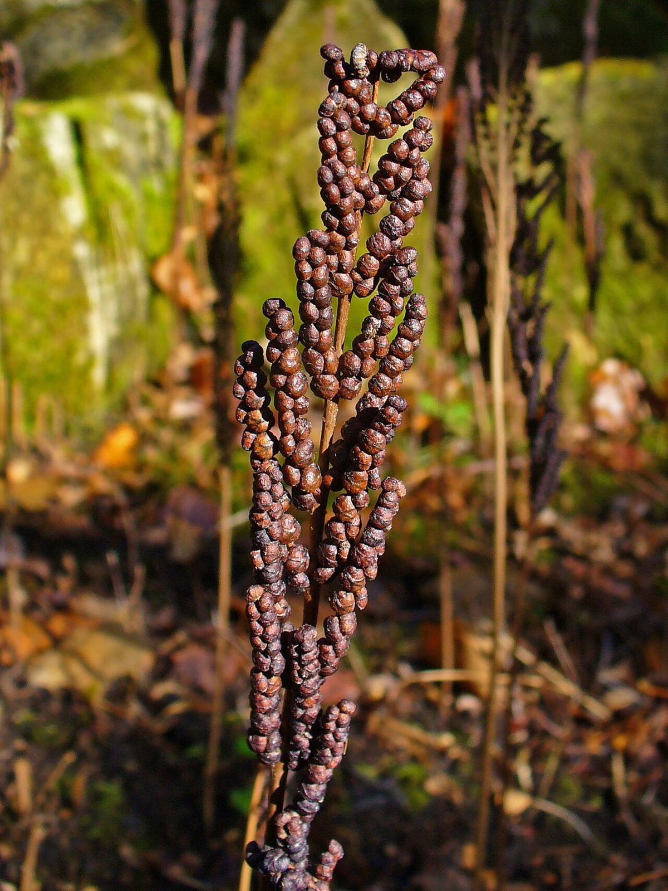

# Sensitive Fern

*Onoclea sensibilis*

Onoclea sensibilis, the sensitive fern, also known as the bead fern, is a coarse-textured, medium to large-sized deciduous perennial fern. The name comes from its sensitivity to frost, the fronds dying quickly when first touched by it. It is sometimes treated as the only species in Onoclea, but some authors do not consider the genus monotypic.

## Quick Facts

| | |
|---|---|
| **Scientific name** | *Onoclea sensibilis* |
| **Family** | — |
| **Height** | — |
| **Bloom time** | — |
| **Sun** | — |
| **Moisture** | — |
| **Soil** | — |
| **Wildlife value** | — |

## Mentioned In

- [Woodland Forest Plants](../chapters/04-woodland-forest-plants/index.md)

## Image Credits

- David Short from Windsor, UK (CC BY 2.0)
- H. Zell (CC BY-SA 3.0)

## Learn More

- [Wikipedia: Onoclea sensibilis](https://en.wikipedia.org/wiki/Onoclea_sensibilis)
