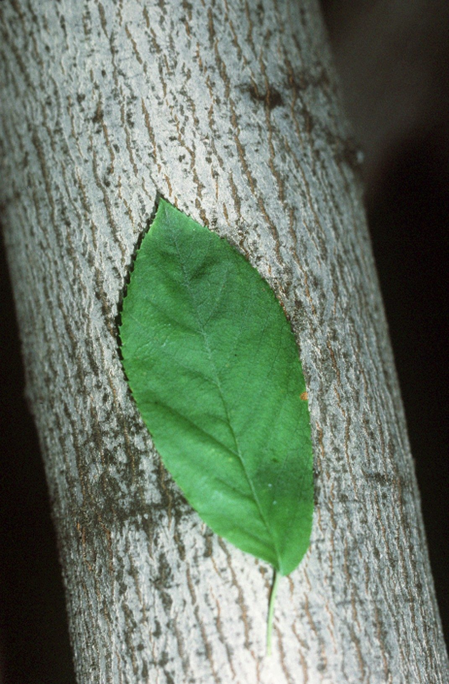

# Serviceberry

*Amelanchier laevis*

Amelanchier laevis, the smooth shadbush, smooth serviceberry or Allegheny serviceberry, is a North American species of tree in the rose family Rosaceae, growing up to 9 metres (30 ft) tall. It is native to eastern Canada and the eastern United States, from Newfoundland west to Ontario, Minnesota, and Iowa, south as far as Georgia and Alabama.

## Quick Facts

| | |
|---|---|
| **Scientific name** | *Amelanchier laevis* |
| **Family** | — |
| **Height** | — |
| **Bloom time** | — |
| **Sun** | — |
| **Moisture** | — |
| **Soil** | — |
| **Wildlife value** | — |

## Mentioned In

- [Garden Design Native Plants](../chapters/10-garden-design-native-plants/index.md)

## Image Credits

- Dan Keck from Ohio (CC0)
- Robert H. Mohlenbrock (Public domain)

## Learn More

- [Wikipedia: Amelanchier laevis](https://en.wikipedia.org/wiki/Amelanchier_laevis)
