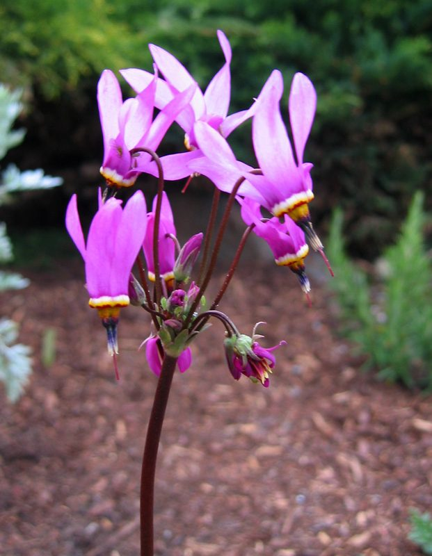
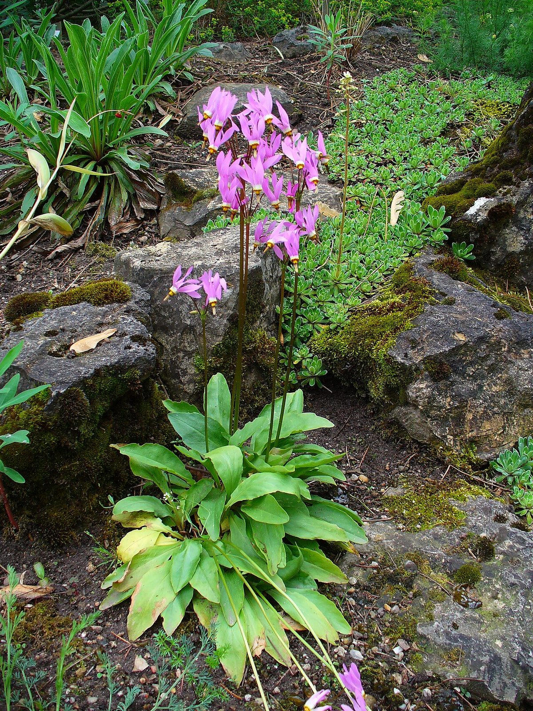

# Shooting Star

*Dodecatheon meadia*

Primula meadia (syn. Dodecatheon meadia), known by the common names shooting star, eastern shooting star, American cowslip, roosterheads, and prairie pointers is a species of flowering plant in the primula family Primulaceae. Also, the plant belongs to a group of herbaceous perennials.

## Quick Facts

| | |
|---|---|
| **Scientific name** | *Dodecatheon meadia* |
| **Family** | Primulaceae |
| **Height** | 1-2 ft |
| **Bloom time** | May-Jun |
| **Sun** | Full sun to part shade |
| **Moisture** | Mesic |
| **Soil** | Loam |
| **Wildlife value** | Buzz-pollinated - bumble bees vibrate the pollen loose; goes dormant by midsummer |

## Mentioned In

- [Ecological Restoration](../chapters/12-ecological-restoration/index.md)

## Image Credits

- Pfly (CC BY-SA 2.0)
- H. Zell (CC BY-SA 3.0)

## Learn More

- [Wikipedia: Primula meadia](https://en.wikipedia.org/wiki/Primula_meadia)
