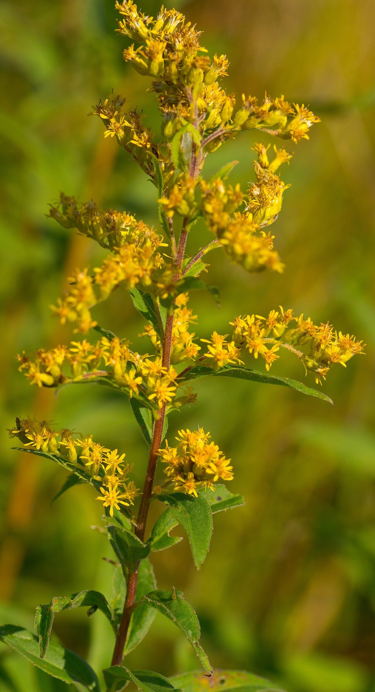

# Showy Goldenrod

*Solidago speciosa*

Solidago speciosa, the showy goldenrod, is a North American species of flowering plants in the family Asteraceae. It grows in the province of Ontario in central Canada, as well as in the eastern and central United States (from the Atlantic coast west as far as the Great Plains, so from Maine to Georgia (except Delaware) west as far as Texas, Nebraska, and the Dakotas).
Solidago speciosa is a perennial herb up to 200 cm (80 inches, over 6 feet) tall, producing a thick underground caudex.

## Quick Facts

| | |
|---|---|
| **Scientific name** | *Solidago speciosa* |
| **Family** | — |
| **Height** | — |
| **Bloom time** | — |
| **Sun** | — |
| **Moisture** | — |
| **Soil** | — |
| **Wildlife value** | — |

## Mentioned In

- [Pollinators Wildlife](../chapters/06-pollinators-wildlife/index.md)

## Image Credits

- New York Botanical Garden. (Public domain)
- Joshua Mayer from Madison, WI, USA (CC BY-SA 2.0)

## Learn More

- [Wikipedia: Solidago speciosa](https://en.wikipedia.org/wiki/Solidago_speciosa)
