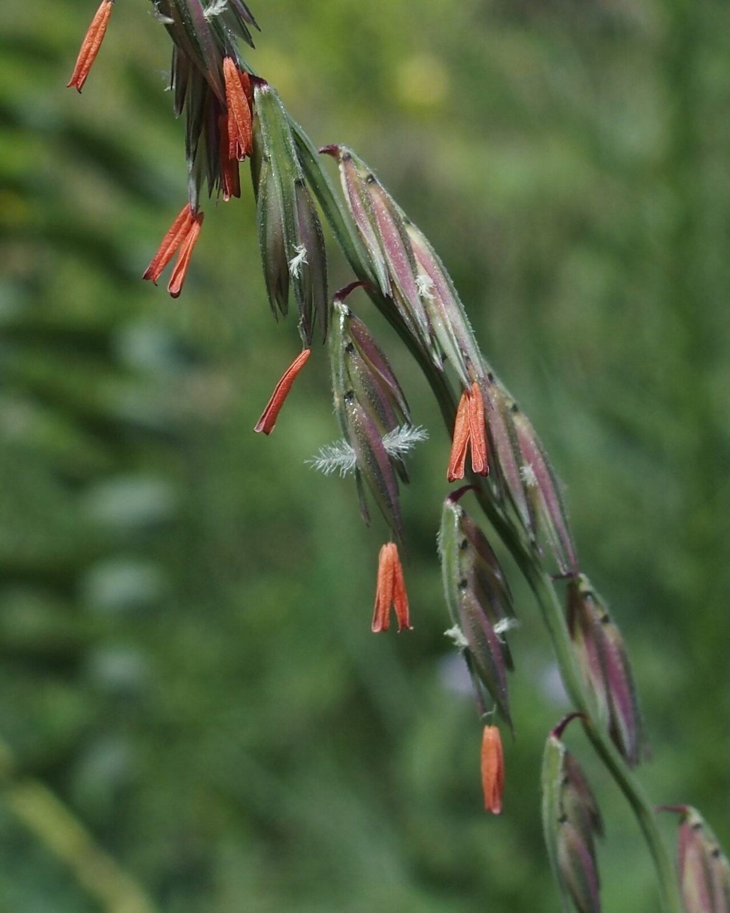

# Side-Oats Grama

*Bouteloua curtipendula*

Bouteloua curtipendula, commonly known as sideoats grama, is a perennial, short prairie grass that is native throughout the temperate and tropical Western Hemisphere, from Canada south to Argentina.
The species epithet comes from Latin curtus "shortened" and pendulus "hanging".

## Quick Facts

| | |
|---|---|
| **Scientific name** | *Bouteloua curtipendula* |
| **Family** | — |
| **Height** | — |
| **Bloom time** | — |
| **Sun** | — |
| **Moisture** | — |
| **Soil** | — |
| **Wildlife value** | — |

## Mentioned In

- [Garden Design Native Plants](../chapters/10-garden-design-native-plants/index.md)

## Image Credits

- Unknown (Public domain)
- Erutuon (CC BY-SA 4.0)

## Learn More

- [Wikipedia: Bouteloua curtipendula](https://en.wikipedia.org/wiki/Bouteloua_curtipendula)
