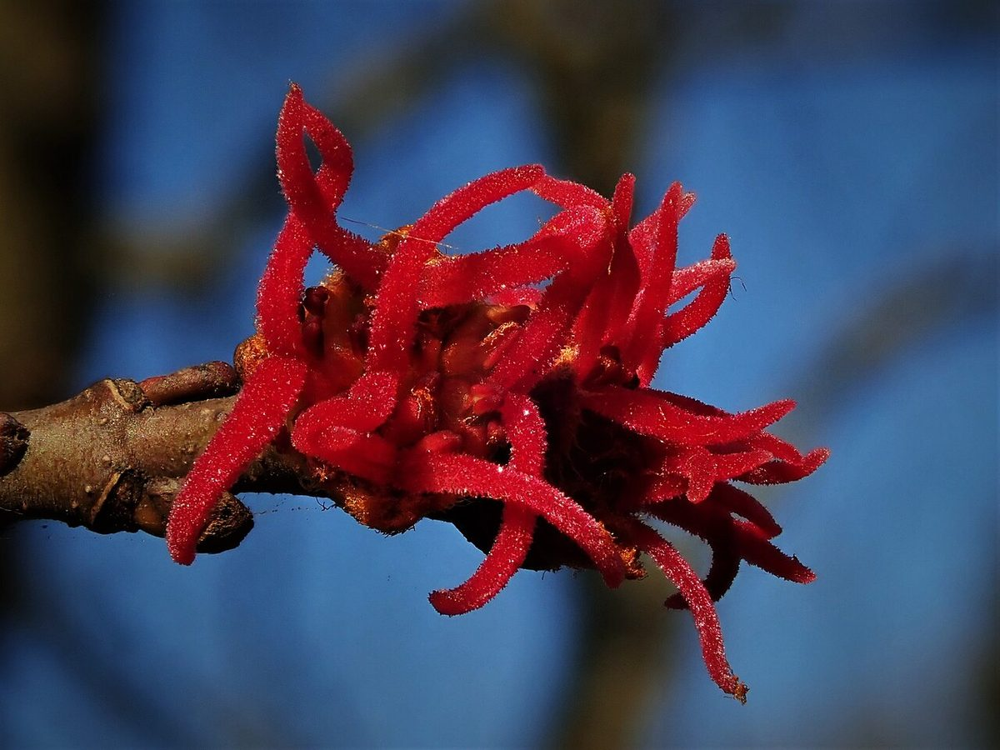

# Silver Maple

*Acer saccharinum*

Acer saccharinum, commonly known as silver maple, creek maple, silverleaf maple, soft maple, large maple, water maple, swamp maple, or white maple, is a species of maple native to the eastern and central United States and southeastern Canada. It is one of the most common trees in the United States.
Although the silver maple's Latin name is similar, it should not be confused with Acer saccharum, the sugar maple.

## Quick Facts

| | |
|---|---|
| **Scientific name** | *Acer saccharinum* |
| **Family** | — |
| **Height** | — |
| **Bloom time** | — |
| **Sun** | — |
| **Moisture** | — |
| **Soil** | — |
| **Wildlife value** | — |

## Mentioned In

- [Ecoregions Growing Conditions](../chapters/02-ecoregions-growing-conditions/index.md)
- [Wetland Shoreline Plants](../chapters/05-wetland-shoreline-plants/index.md)

## Image Credits

- Famartin (CC BY-SA 4.0)
- Daniel Cahen (CC BY-SA 4.0)

## Learn More

- [Wikipedia: Acer saccharinum](https://en.wikipedia.org/wiki/Acer_saccharinum)
