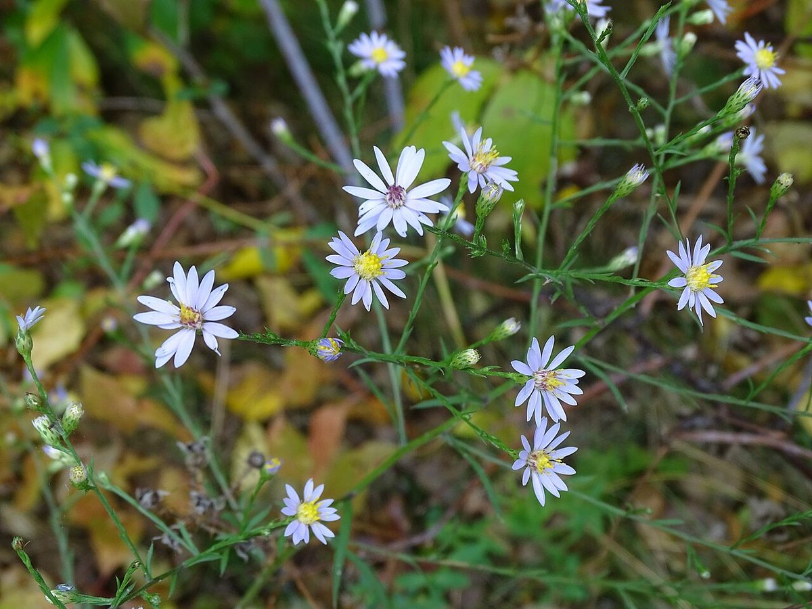

# Sky Blue Aster

*Symphyotrichum oolentangiense*

Symphyotrichum oolentangiense (formerly Aster oolentangiensis and Aster azureus), commonly known as skyblue aster and azure aster, is a species of flowering plant in the family Asteraceae native to eastern North America.

## Quick Facts

| | |
|---|---|
| **Scientific name** | *Symphyotrichum oolentangiense* |
| **Family** | — |
| **Height** | — |
| **Bloom time** | — |
| **Sun** | — |
| **Moisture** | — |
| **Soil** | — |
| **Wildlife value** | — |

## Mentioned In

- [Prairie Plants Grasslands](../chapters/03-prairie-plants-grasslands/index.md)

## Image Credits

- aarongunnar (CC BY 4.0)
- Reuven Martin (CC0)

## Learn More

- [Wikipedia: Symphyotrichum oolentangiense](https://en.wikipedia.org/wiki/Symphyotrichum_oolentangiense)
