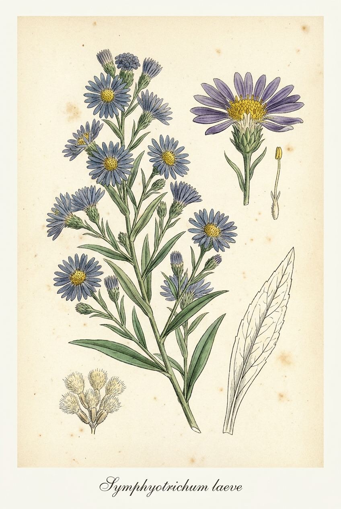
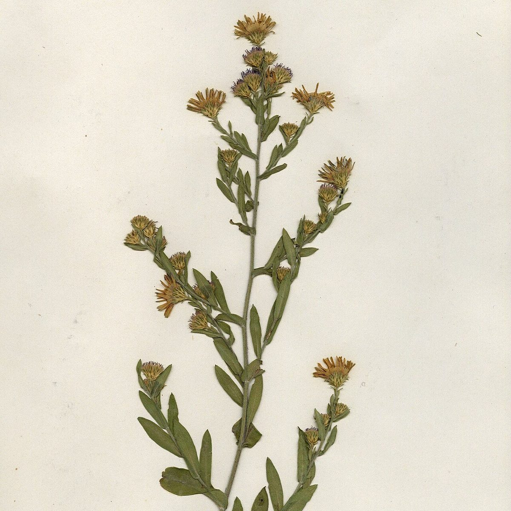

# Smooth Blue Aster

*Symphyotrichum laeve*

{ .plant-illustration }

*Botanical plate of* **Symphyotrichum laeve** *— Curtis-style illustration.*

Symphyotrichum laeve (formerly Aster laevis) is a flowering plant native to Canada, the United States, and Coahuila (Mexico). It has the common names of smooth blue aster, smooth aster, smooth-leaved aster, glaucous Michaelmas-daisy and glaucous aster.

## Quick Facts

| | |
|---|---|
| **Scientific name** | *Symphyotrichum laeve* |
| **Family** | — |
| **Height** | — |
| **Bloom time** | — |
| **Sun** | — |
| **Moisture** | — |
| **Soil** | — |
| **Wildlife value** | — |

## Mentioned In

- [Prairie Plants Grasslands](../chapters/03-prairie-plants-grasslands/index.md)
- [Pollinators Wildlife](../chapters/06-pollinators-wildlife/index.md)
- [Ecological Restoration](../chapters/12-ecological-restoration/index.md)

## Image Credits

- The New York Botanical Garden (CC BY 4.0)
- Harvard University Herbaria (CC BY 4.0)

## Learn More

- [Wikipedia: Symphyotrichum laeve](https://en.wikipedia.org/wiki/Symphyotrichum_laeve)
