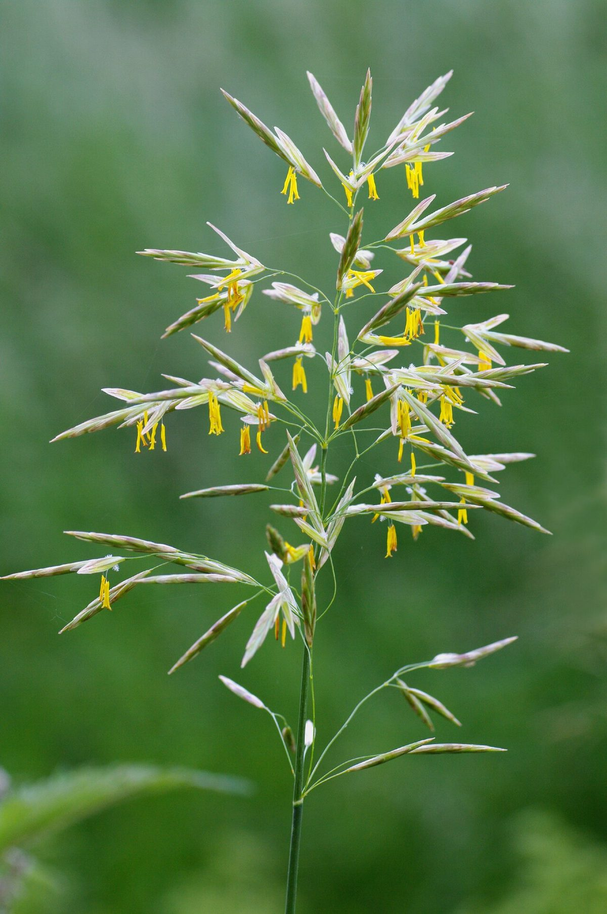

# Smooth Brome

*Bromus inermis*

Bromus inermis is a species of the true grass family (Poaceae). This rhizomatous grass is native to Europe and considered invasive in North America.
The plant is an erect, leafy, long-lived perennial, 46 to 91 cm (1+1⁄2 to 3 ft) tall, rhizomatous and commonly producing a dense sod.

## Quick Facts

| | |
|---|---|
| **Scientific name** | *Bromus inermis* |
| **Family** | — |
| **Height** | — |
| **Bloom time** | — |
| **Sun** | — |
| **Moisture** | — |
| **Soil** | — |
| **Wildlife value** | — |

## Mentioned In

- [Prairie Plants Grasslands](../chapters/03-prairie-plants-grasslands/index.md)

## Image Credits

- Christian Fischer (CC BY-SA 3.0)

## Learn More

- [Wikipedia: Bromus inermis](https://en.wikipedia.org/wiki/Bromus_inermis)
