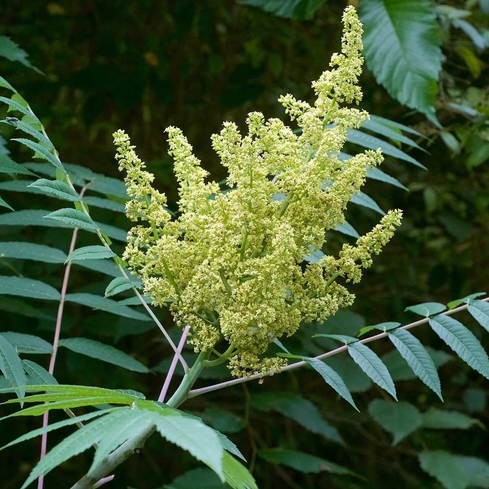

# Smooth Sumac

*Rhus glabra*

Rhus glabra, the smooth sumac (also known as white sumac, upland sumac, or scarlet sumac), is a North American species of sumac in the family Anacardiaceae.

## Quick Facts

| | |
|---|---|
| **Scientific name** | *Rhus glabra* |
| **Family** | — |
| **Height** | — |
| **Bloom time** | — |
| **Sun** | — |
| **Moisture** | — |
| **Soil** | — |
| **Wildlife value** | — |

## Mentioned In

- [Ecological Restoration](../chapters/12-ecological-restoration/index.md)

## Image Credits

- Unknown (Public domain)
- Eric Hunt (CC BY-SA 4.0)

## Learn More

- [Wikipedia: Rhus glabra](https://en.wikipedia.org/wiki/Rhus_glabra)
