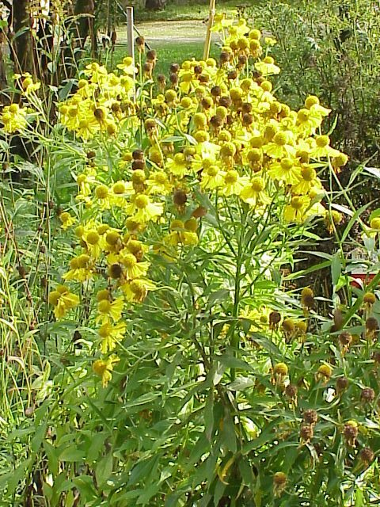

# Sneezeweed

*Helenium autumnale*

Helenium autumnale is a North American species of flowering plants in the family Asteraceae. Common names include common sneezeweed and large-flowered sneezeweed.

## Quick Facts

| | |
|---|---|
| **Scientific name** | *Helenium autumnale* |
| **Family** | — |
| **Height** | — |
| **Bloom time** | — |
| **Sun** | — |
| **Moisture** | — |
| **Soil** | — |
| **Wildlife value** | — |

## Mentioned In

- [Ecological Restoration](../chapters/12-ecological-restoration/index.md)

## Image Credits

- Dominicus Johannes Bergsma (CC BY-SA 4.0)
- Unknown (CC BY-SA 3.0)

## Learn More

- [Wikipedia: Helenium autumnale](https://en.wikipedia.org/wiki/Helenium_autumnale)
