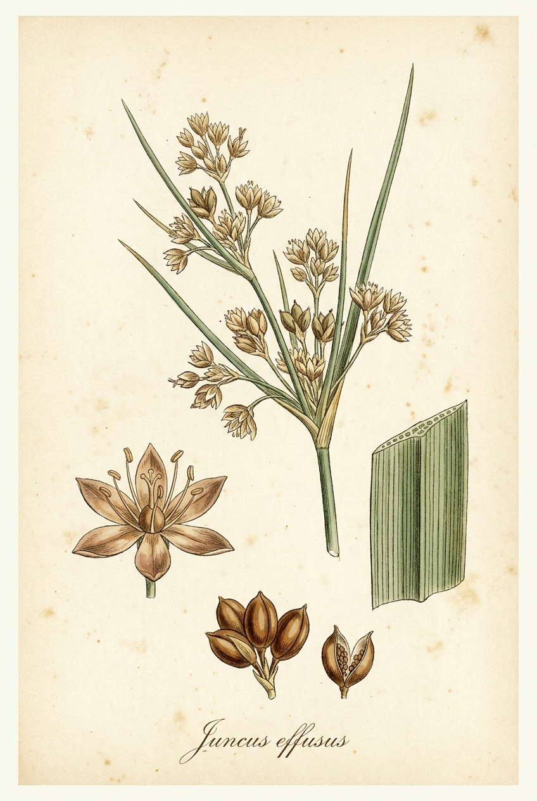
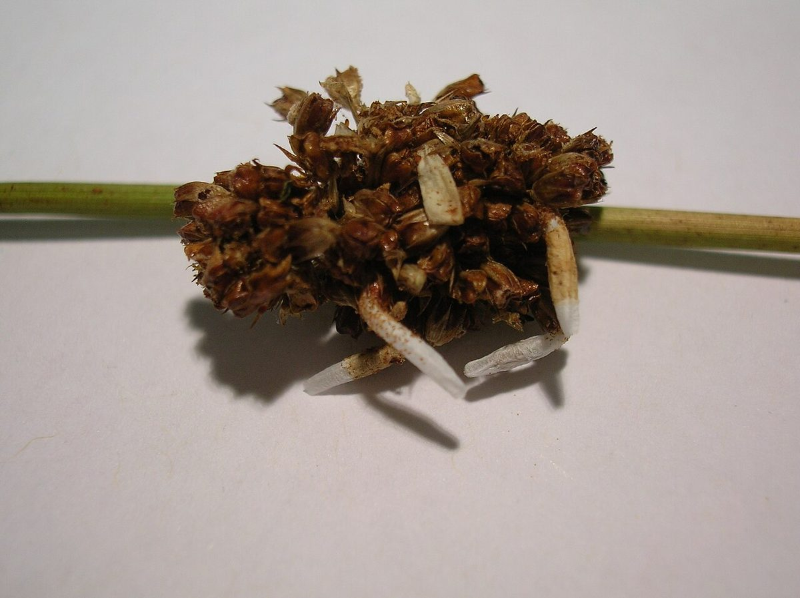

# Soft Rush

*Juncus effusus*

{ .plant-illustration }

*Botanical plate of* **Juncus effusus** *— Curtis-style illustration.*

Juncus effusus is a perennial herbaceous flowering plant species in the rush family Juncaceae, with the common names common rush or soft rush.  In North America, the common name soft rush also refers to Juncus interior.

## Quick Facts

| | |
|---|---|
| **Scientific name** | *Juncus effusus* |
| **Family** | — |
| **Height** | — |
| **Bloom time** | — |
| **Sun** | — |
| **Moisture** | — |
| **Soil** | — |
| **Wildlife value** | — |

## Mentioned In

- [Garden Design Native Plants](../chapters/10-garden-design-native-plants/index.md)

## Image Credits

- The original uploader was Meggar at English Wikipedia. (CC BY-SA 3.0)
- Rosser1954 Roger Griffith (Public domain)

## Learn More

- [Wikipedia: Juncus effusus](https://en.wikipedia.org/wiki/Juncus_effusus)
