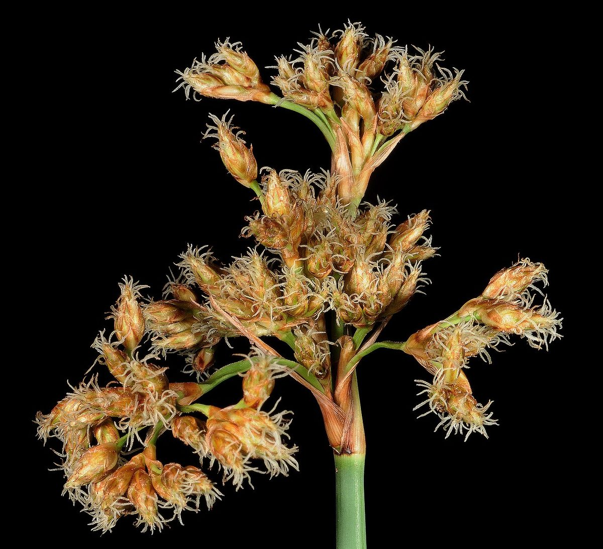

# Soft-Stem Bulrush

*Schoenoplectus tabernaemontani*

Schoenoplectus tabernaemontani is a species of flowering plant in the sedge family known by the common names grey club-rush, softstem bulrush, and great bulrush.

## Quick Facts

| | |
|---|---|
| **Scientific name** | *Schoenoplectus tabernaemontani* |
| **Family** | — |
| **Height** | — |
| **Bloom time** | — |
| **Sun** | — |
| **Moisture** | — |
| **Soil** | — |
| **Wildlife value** | — |

## Mentioned In

- [Ecological Restoration](../chapters/12-ecological-restoration/index.md)

## Image Credits

- Christian Fischer (CC BY-SA 3.0)
- Kevin Thiele from Perth, Australia (CC BY 2.0)

## Learn More

- [Wikipedia: Schoenoplectus tabernaemontani](https://en.wikipedia.org/wiki/Schoenoplectus_tabernaemontani)
