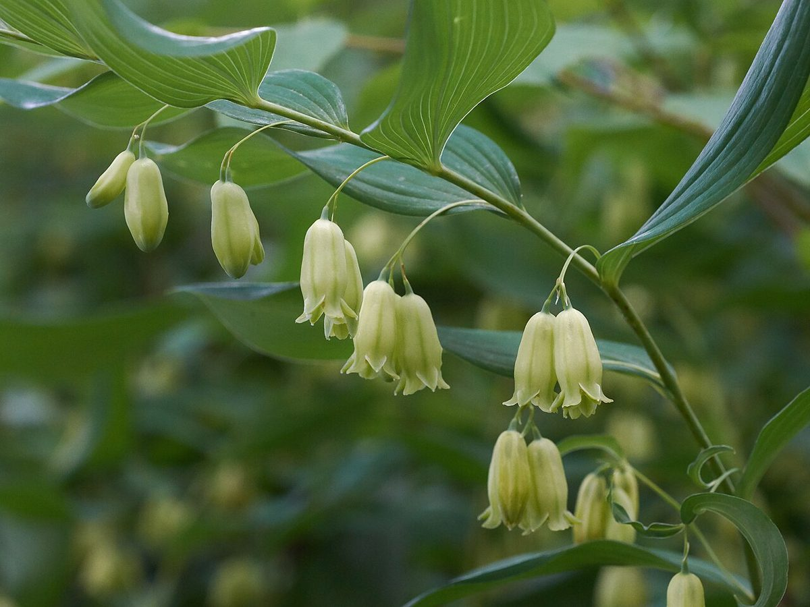

# Solomon's Seal

*Polygonatum biflorum*

Polygonatum biflorum (smooth Solomon's-seal, great Solomon's-seal, Solomon's seal) is an  herbaceous flowering plant native to eastern and central North America.  The plant is said to possess scars on the rhizome that resemble the ancient Hebrew seal of King Solomon. It is often confused with Solomon's plume, which has upright flowers.

## Quick Facts

| | |
|---|---|
| **Scientific name** | *Polygonatum biflorum* |
| **Family** | — |
| **Height** | — |
| **Bloom time** | — |
| **Sun** | — |
| **Moisture** | — |
| **Soil** | — |
| **Wildlife value** | — |

## Mentioned In

- [Woodland Forest Plants](../chapters/04-woodland-forest-plants/index.md)

## Image Credits

- Eric Hunt (CC BY-SA 4.0)

## Learn More

- [Wikipedia: Polygonatum biflorum](https://en.wikipedia.org/wiki/Polygonatum_biflorum)
