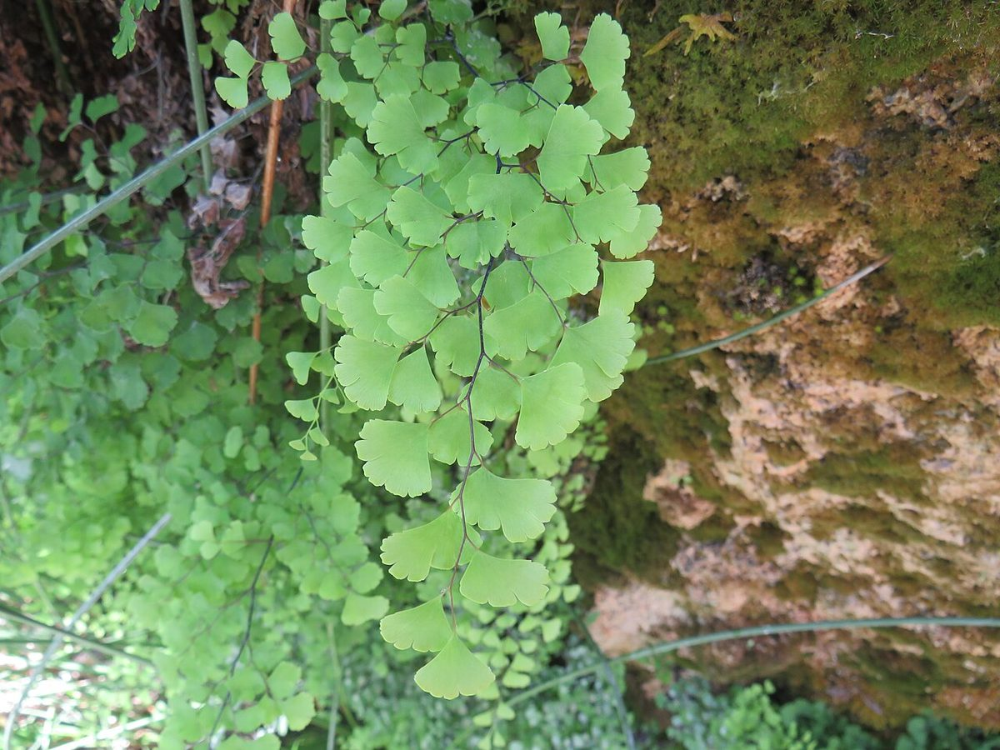

# Southern Maidenhair

*Adiantum capillus-veneris*

Adiantum capillus-veneris, the maidenhair fern, southern maidenhair fern, black maidenhair fern and venus hair fern, is a species of ferns in the genus Adiantum and the family Pteridaceae with a subcosmopolitan worldwide distribution. It is cultivated as a popular garden fern and houseplant.

## Quick Facts

| | |
|---|---|
| **Scientific name** | *Adiantum capillus-veneris* |
| **Family** | — |
| **Height** | — |
| **Bloom time** | — |
| **Sun** | — |
| **Moisture** | — |
| **Soil** | — |
| **Wildlife value** | — |

## Mentioned In

- [Woodland Forest Plants](../chapters/04-woodland-forest-plants/index.md)

## Image Credits

- This file is a work by Ester Inbar (user:ST or he:user:ST). More of my work can be found in Category:Files by User:ST. If you use my work outside Wikimedia I would appreciate being notified and referr (Attribution)
- Balles2601 (CC BY-SA 4.0)

## Learn More

- [Wikipedia: Adiantum capillus-veneris](https://en.wikipedia.org/wiki/Adiantum_capillus-veneris)
