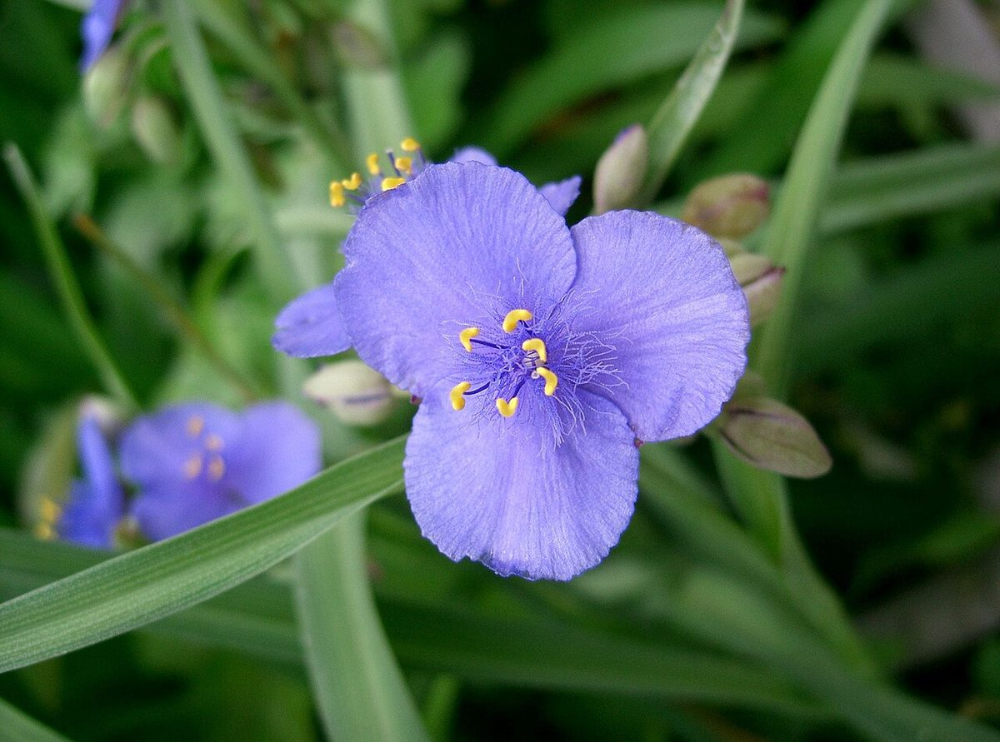

# Spiderwort

*Tradescantia ohiensis*

Tradescantia ohiensis, commonly known as bluejacket or Ohio spiderwort, is an herbaceous plant species in the genus Tradescantia native to eastern and central North America.  It is the most common and widely distributed species of Tradescantia in the United States, where it can be found from Maine in the northeast, west to Minnesota, and south to Texas and Florida. It also has a very small distribution in Canada in extreme southern Ontario near Windsor.

## Quick Facts

| | |
|---|---|
| **Scientific name** | *Tradescantia ohiensis* |
| **Family** | — |
| **Height** | — |
| **Bloom time** | — |
| **Sun** | — |
| **Moisture** | — |
| **Soil** | — |
| **Wildlife value** | — |

## Mentioned In

- [Pollinators Wildlife](../chapters/06-pollinators-wildlife/index.md)

## Image Credits

- KENPEI (CC BY-SA 3.0)

## Learn More

- [Wikipedia: Tradescantia ohiensis](https://en.wikipedia.org/wiki/Tradescantia_ohiensis)
