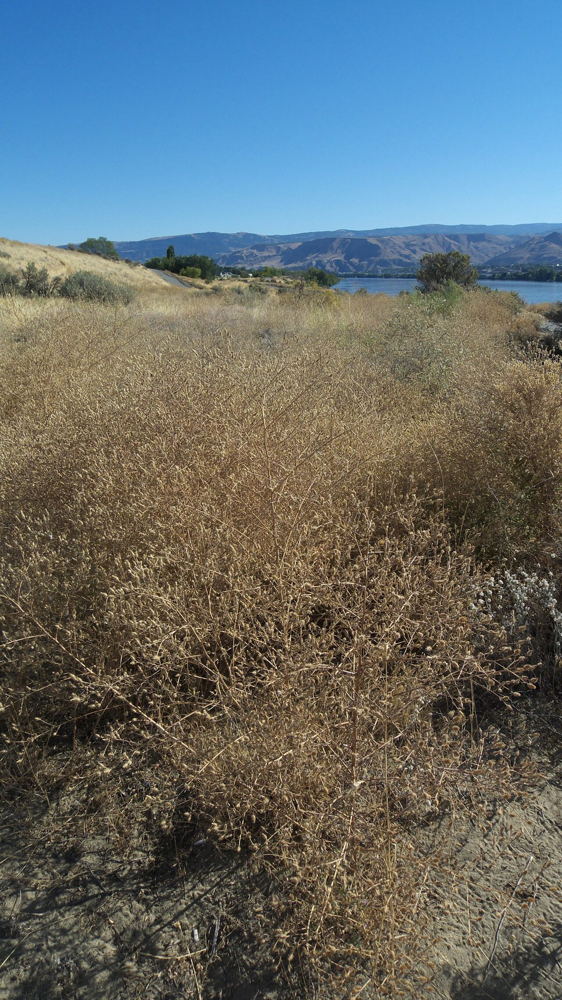

# Spotted Knapweed

*Centaurea stoebe*

Centaurea stoebe, the spotted knapweed or panicled knapweed, is a species of Centaurea native to eastern Europe, although it has spread to North America, where it is considered an invasive species. It forms a tumbleweed, helping to increase the species' reach, and the seeds are also enabled by a feathery pappus.

## Quick Facts

| | |
|---|---|
| **Scientific name** | *Centaurea stoebe* |
| **Family** | — |
| **Height** | — |
| **Bloom time** | — |
| **Sun** | — |
| **Moisture** | — |
| **Soil** | — |
| **Wildlife value** | — |

## Mentioned In

- [Invasive Species Id](../chapters/08-invasive-species-id/index.md)

## Image Credits

- Matt Lavin from Bozeman, Montana, USA (CC BY-SA 2.0)
- Thayne Tuason (CC BY-SA 4.0)

## Learn More

- [Wikipedia: Centaurea stoebe](https://en.wikipedia.org/wiki/Centaurea_stoebe)
