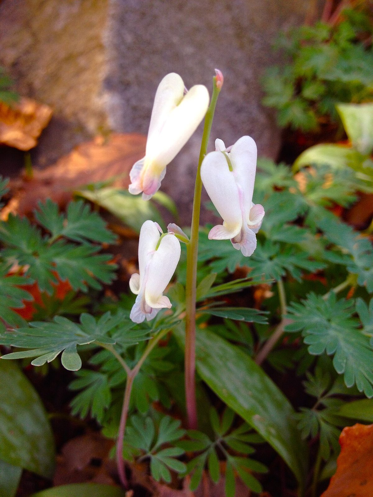

# Squirrel Corn

*Dicentra canadensis*

Dicentra canadensis, the squirrel corn, is a flowering plant from eastern North America with oddly shaped white flowers and finely divided leaves.

## Quick Facts

| | |
|---|---|
| **Scientific name** | *Dicentra canadensis* |
| **Family** | Papaveraceae |
| **Height** | 6-12 in |
| **Bloom time** | Apr-May |
| **Sun** | Part shade to shade |
| **Moisture** | Mesic |
| **Soil** | Rich loam |
| **Wildlife value** | Spring ephemeral; yellow corn-like tubers; queen bumble bee forage |

## Mentioned In

- [Woodland Forest Plants](../chapters/04-woodland-forest-plants/index.md)

## Image Credits

- Fritzflohrreynolds (CC BY-SA 3.0)

## Learn More

- [Wikipedia: Dicentra canadensis](https://en.wikipedia.org/wiki/Dicentra_canadensis)
